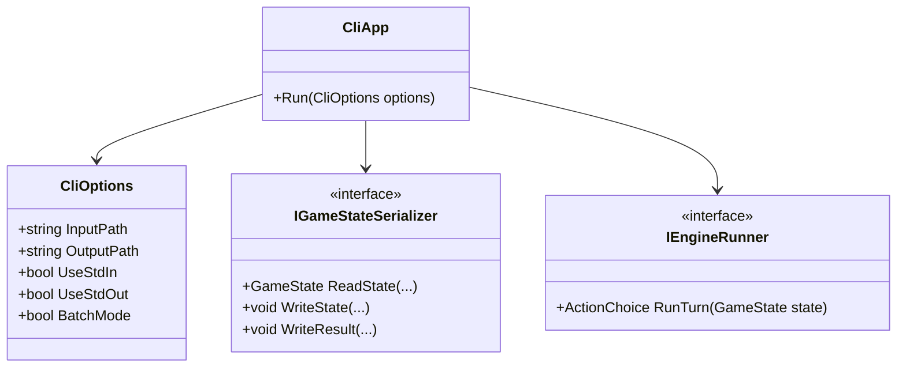

# cli

```mermaid
classDiagram


    class CliApp {
        +Run(CliOptions options)
    }

    class CliOptions {
        +string InputPath
        +string OutputPath
        +bool UseStdIn
        +bool UseStdOut
        +bool BatchMode
    }

    class IGameStateSerializer {
        <<interface>>
        +GameState ReadState(...)
        +void WriteState(...)
        +void WriteResult(...)
    }


    class IEngineRunner {
        <<interface>>
        +ActionChoice RunTurn(GameState state)
    }


    CliApp --> CliOptions
    CliApp --> IGameStateSerializer
    CliApp --> IEngineRunner


   
```
