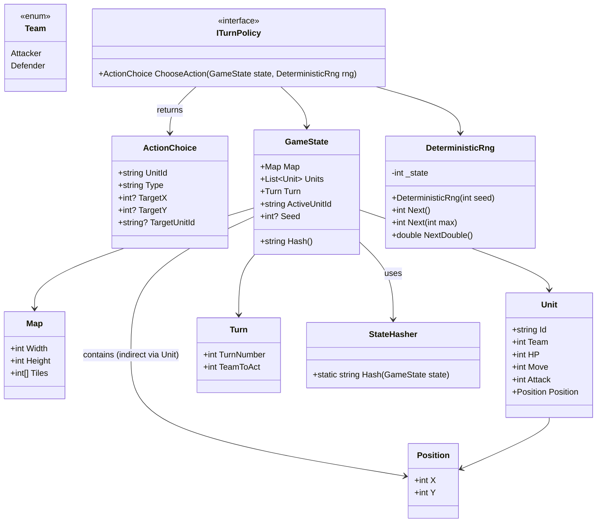

# core

```mermaid
classDiagram

    %% ========== DOMAIN / ENTITIES ==========

    class Map {
        +int Width
        +int Height
        +int[] Tiles
    }

    class Unit {
        +string Id
        +int Team
        +int HP
        +int Move
        +int Attack
        +Position Position
    }

    class Turn {
        +int TurnNumber
        +int TeamToAct
    }

    class ActionChoice {
        +string UnitId
        +string Type
        +int? TargetX
        +int? TargetY
        +string? TargetUnitId
    }

    class Position {
        +int X
        +int Y
    }

    class GameState {
        +Map Map
        +List~Unit~ Units
        +Turn Turn
        +string ActiveUnitId
        +int? Seed
        +string Hash()
    }

    %% ========== DOMAIN / VALUE OBJECTS ==========

    class Team {
        <<enum>>
        Attacker
        Defender
    }

    %% ========== INFRASTRUCTURE ==========

    class DeterministicRng {
        -int _state
        +DeterministicRng(int seed)
        +int Next()
        +int Next(int max)
        +double NextDouble()
    }

    class StateHasher {
        +static string Hash(GameState state)
    }

    %% ========== SERVICES ==========

    class ITurnPolicy {
        <<interface>>
        +ActionChoice ChooseAction(GameState state, DeterministicRng rng)
    }

    %% ========== RELATIONSHIPS ==========

    GameState --> Map
    GameState --> Unit
    GameState --> Turn
    GameState --> Position : contains (indirect via Unit)
    GameState --> StateHasher : uses

    Unit --> Position

    ITurnPolicy --> GameState
    ITurnPolicy --> DeterministicRng
    ITurnPolicy --> ActionChoice : returns

```
