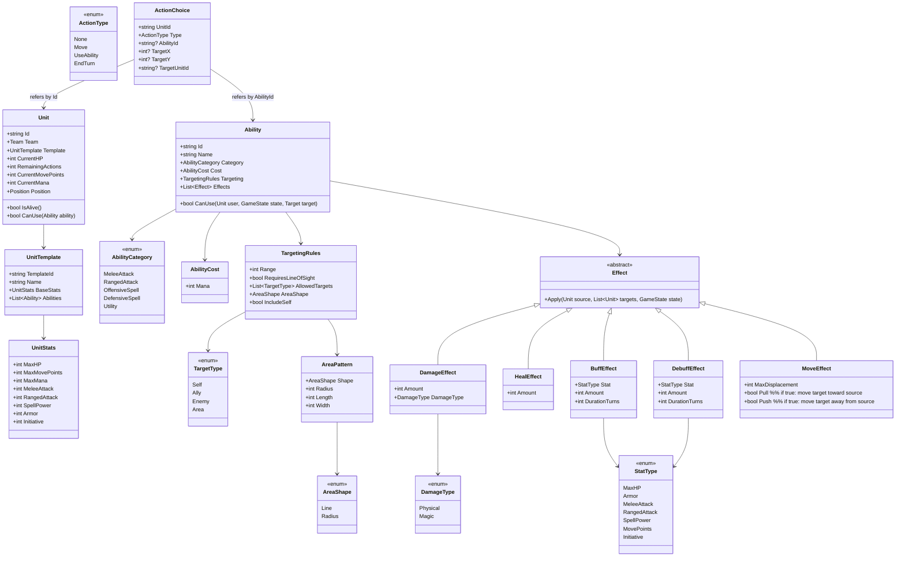

# units

```mermaid
classDiagram

    %% ========== UNIT CORE ==========

    class Unit {
        +string Id
        +Team Team
        +UnitTemplate Template
        +int CurrentHP
        +int RemainingActions
        +int CurrentMovePoints
        +int CurrentMana
        +Position Position
        +bool IsAlive()
        +bool CanUse(Ability ability)
    }

    class UnitTemplate {
        +string TemplateId
        +string Name
        +UnitStats BaseStats
        +List~Ability~ Abilities
    }

    class UnitStats {
        +int MaxHP
        +int MaxMovePoints
        +int MaxMana
        +int MeleeAttack
        +int RangedAttack
        +int SpellPower
        +int Armor
        +int Initiative
    }

    Unit --> UnitTemplate
    UnitTemplate --> UnitStats

    %% ========== ABILITIES ==========

    class Ability {
        +string Id
        +string Name
        +AbilityCategory Category
        +AbilityCost Cost
        +TargetingRules Targeting
        +List~Effect~ Effects
        +bool CanUse(Unit user, GameState state, Target target)
    }

    class AbilityCategory {
        <<enum>>
        MeleeAttack
        RangedAttack
        OffensiveSpell
        DefensiveSpell
        Utility
    }

    class AbilityCost {
        +int Mana
    }

    class TargetingRules {
        +int Range
        +bool RequiresLineOfSight
        +List~TargetType~ AllowedTargets
        +AreaShape AreaShape
        +bool IncludeSelf
    }

    class TargetType {
        <<enum>>
        Self
        Ally
        Enemy
        Area
    }

    class AreaPattern {
        +AreaShape Shape
        +int Radius
        +int Length 
        +int Width
    }

    class AreaShape {
        <<enum>>
        Line
        Radius
    }

    class ActionType{
        <<enum>>
        None
        Move
        UseAbility
        EndTurn
    }

    Ability --> AbilityCategory
    Ability --> AbilityCost
    Ability --> TargetingRules

    TargetingRules --> TargetType
    TargetingRules --> AreaPattern
    AreaPattern --> AreaShape


    %% ========== EFFECTS ==========

    class Effect {
        <<abstract>>
        +Apply(Unit source, List~Unit~ targets, GameState state)
    }

    class DamageEffect {
        +int Amount
        +DamageType DamageType
    }

    class HealEffect {
        +int Amount
    }

    class BuffEffect {
        +StatType Stat
        +int Amount
        +int DurationTurns
    }

    class DebuffEffect {
        +StatType Stat
        +int Amount
        +int DurationTurns
    }

    class MoveEffect {
        +int MaxDisplacement
        +bool Pull          %% if true: move target toward source
        +bool Push          %% if true: move target away from source
    }

    class DamageType {
        <<enum>>
        Physical
        Magic
    }

    class StatType {
        <<enum>>
        MaxHP
        Armor
        MeleeAttack
        RangedAttack
        SpellPower
        MovePoints
        Initiative
    }

    Effect <|-- DamageEffect
    Effect <|-- HealEffect
    Effect <|-- BuffEffect
    Effect <|-- DebuffEffect
    Effect <|-- MoveEffect

    Ability --> Effect
    DamageEffect --> DamageType
    BuffEffect --> StatType
    DebuffEffect --> StatType

    %% ========== ACTION CHOICE LINK ==========

    class ActionChoice {
        +string UnitId
        +ActionType Type
        +string? AbilityId
        +int? TargetX
        +int? TargetY
        +string? TargetUnitId
    }


    ActionChoice --> Unit : refers by Id
    ActionChoice --> Ability : refers by AbilityId


```
