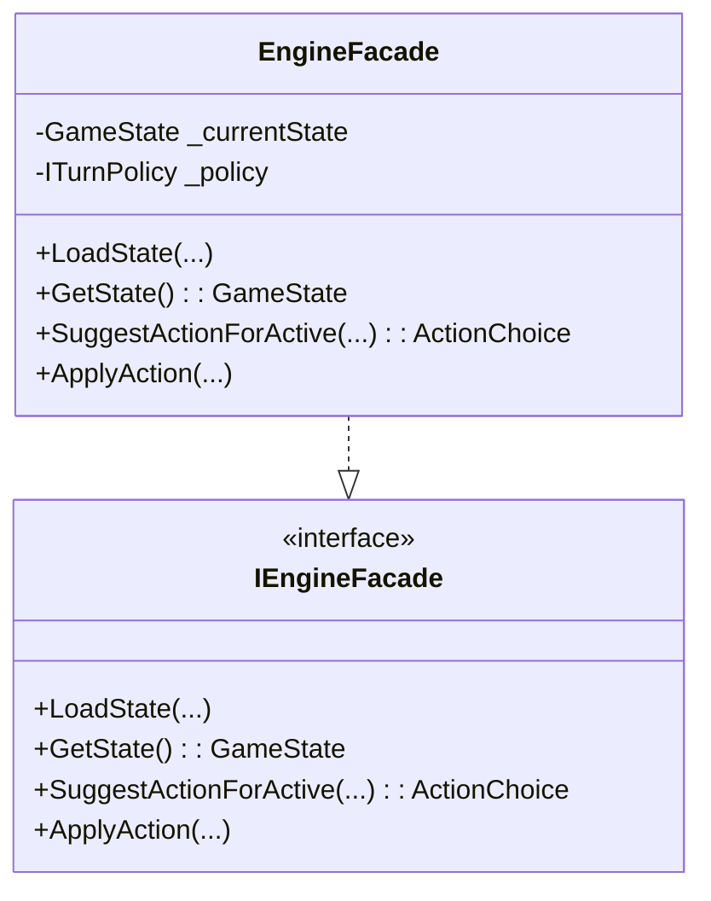

# unity_adapter

```mermaid
classDiagram

    class IEngineFacade {
        <<interface>>
        +LoadState(...)
        +GetState() : GameState
        +SuggestActionForActive(...) : ActionChoice
        +ApplyAction(...)
    }

    class EngineFacade {
        -GameState _currentState
        -ITurnPolicy _policy
        +LoadState(...)
        +GetState() : GameState
        +SuggestActionForActive(...) : ActionChoice
        +ApplyAction(...)
    }

    EngineFacade ..|> IEngineFacade


```
