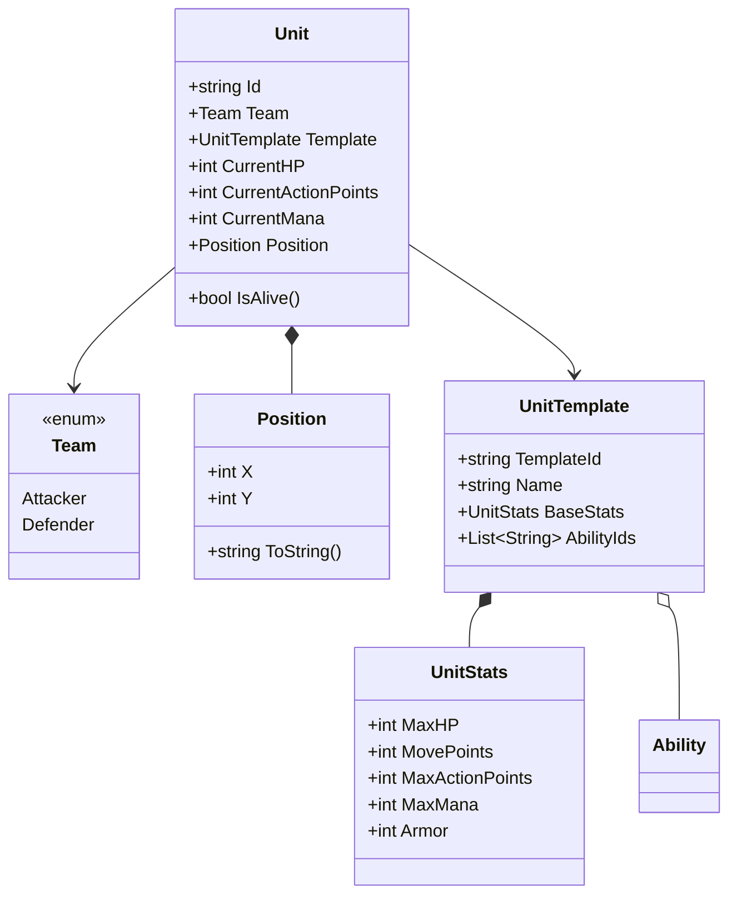

# Unit

```mermaid
classDiagram

    class Team {
        <<enum>>
        Attacker
        Defender
    }

    class Position {
        +int X
        +int Y
        +string ToString()
    }

    %% Unit is a placed unit on the board
    class Unit {
        +string Id
        +Team Team
        +UnitTemplate Template
        +int CurrentHP
        +int CurrentActionPoints
        +int CurrentMana
        +Position Position
        +bool IsAlive()
    }

    class UnitTemplate {
        +string TemplateId
        +string Name
        +UnitStats BaseStats
        +List~String~ AbilityIds
    }

    class UnitStats {
        +int MaxHP
        +int MovePoints
        +int MaxActionPoints
        +int MaxMana
        +int Armor
    }

    %% relationships
    Unit *-- Position
    Unit --> Team
    Unit --> UnitTemplate
    UnitTemplate *-- UnitStats
    UnitTemplate o-- Ability

```
