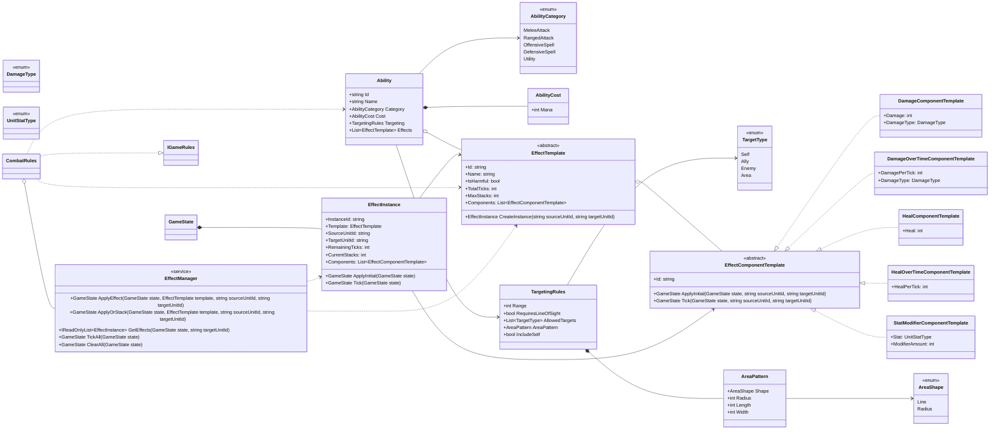

# abilities_and_effects

```mermaid
%% effects_with_abilities
%% Abilities + Combat Engine – Composite, template-centric effects

classDiagram
    direction LR

    %% ============================================================
    %% CORE DOMAIN TYPES (REFERENCED BY EFFECTS)
    %% ============================================================

    class DamageType {
        <<enum>>
    }

    class UnitStatType {
        <<enum>>
    }

    %% ============================================================
    %% ABILITIES & TARGETING
    %% ============================================================

    class Ability {
        +string Id
        +string Name
        +AbilityCategory Category
        +AbilityCost Cost
        +TargetingRules Targeting
        +List~EffectTemplate~ Effects
    }

    class AbilityCategory {
        <<enum>>
        MeleeAttack
        RangedAttack
        OffensiveSpell
        DefensiveSpell
        Utility
    }

    class AbilityCost {
        +int Mana
    }

    class TargetingRules {
        +int Range
        +bool RequiresLineOfSight
        +List~TargetType~ AllowedTargets
        +AreaPattern AreaPattern
        +bool IncludeSelf
    }

    class TargetType {
        <<enum>>
        Self
        Ally
        Enemy
        Area
    }

    class AreaPattern {
        +AreaShape Shape
        +int Radius
        +int Length
        +int Width
    }

    class AreaShape {
        <<enum>>
        Line
        Radius
    }

    %% Ability / targeting relationships
    Ability *-- AbilityCost
    Ability --> AbilityCategory
    Ability --> TargetingRules
    Ability o-- EffectTemplate

    TargetingRules --> TargetType
    TargetingRules *-- AreaPattern
    AreaPattern --> AreaShape

    %% ============================================================
    %% EFFECT COMPONENT TEMPLATES (STATIC)
    %% ============================================================

    class EffectComponentTemplate {
        <<abstract>>
        +Id: string
        +GameState ApplyInitial(GameState state, string sourceUnitId, string targetUnitId)
        +GameState Tick(GameState state, string sourceUnitId, string targetUnitId)
    }

    class DamageComponentTemplate {
        +Damage: int
        +DamageType: DamageType
    }

    class DamageOverTimeComponentTemplate {
        +DamagePerTick: int
        +DamageType: DamageType
    }

    class HealComponentTemplate {
        +Heal: int
    }

    class HealOverTimeComponentTemplate {
        +HealPerTick: int
    }

    class StatModifierComponentTemplate {
        +Stat: UnitStatType
        +ModifierAmount: int
    }

    %% Component inheritance relationships
    EffectComponentTemplate <|.. DamageComponentTemplate
    EffectComponentTemplate <|.. DamageOverTimeComponentTemplate
    EffectComponentTemplate <|.. HealComponentTemplate
    EffectComponentTemplate <|.. HealOverTimeComponentTemplate
    EffectComponentTemplate <|.. StatModifierComponentTemplate

    %% ============================================================
    %% EFFECT TEMPLATES (STATIC CONTAINER)
    %% ============================================================

    class EffectTemplate {
        <<abstract>>
        +Id: string
        +Name: string
        +IsHarmful: bool
        +TotalTicks: int
        +MaxStacks: int
        +Components: List~EffectComponentTemplate~
        +EffectInstance CreateInstance(string sourceUnitId, string targetUnitId)
    }

    %% Effect template relationships
    EffectTemplate o-- EffectComponentTemplate

    %% ============================================================
    %% RUNTIME EFFECT INSTANCES
    %% ============================================================

    class EffectInstance {
        +InstanceId: string
        +Template: EffectTemplate
        +SourceUnitId: string
        +TargetUnitId: string
        +RemainingTicks: int
        +CurrentStacks: int
        +Components: List~EffectComponentTemplate~
        +GameState ApplyInitial(GameState state)
        +GameState Tick(GameState state)
    }

    %% Effect instance relationships
    EffectInstance --> EffectTemplate
    EffectInstance --> EffectComponentTemplate

    %% ============================================================
    %% MANAGER & INTEGRATION WITH COMBAT RULES
    %% ============================================================

    class EffectManager {
        <<service>>
        +GameState ApplyEffect(GameState state, EffectTemplate template, string sourceUnitId, string targetUnitId)
        +GameState ApplyOrStack(GameState state, EffectTemplate template, string sourceUnitId, string targetUnitId)
        +IReadOnlyList~EffectInstance~ GetEffects(GameState state, string targetUnitId)
        +GameState TickAll(GameState state)
        +GameState ClearAll(GameState state)
    }

    %% Combat rules use abilities and effects
    CombatRules ..|> IGameRules
    CombatRules o-- EffectManager
    CombatRules ..> Ability
    CombatRules ..> EffectTemplate

    %% Game state / manager relationships
    GameState *-- EffectInstance
    EffectManager ..> EffectInstance
    EffectManager ..> EffectTemplate

```
