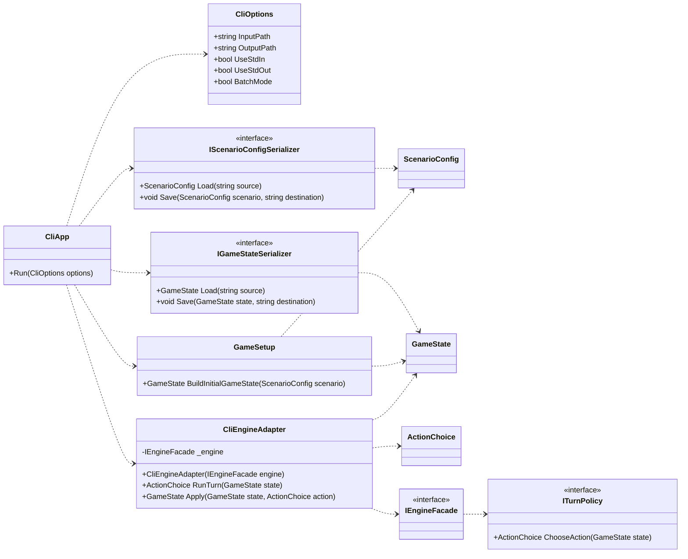

# cli

```mermaid
classDiagram
    direction LR

    %% ============================================================
    %% CLI ENTRYPOINT & OPTIONS
    %% ============================================================

    class CliApp {
        +Run(CliOptions options)
    }

    class CliOptions {
        +string InputPath
        +string OutputPath
        +bool UseStdIn
        +bool UseStdOut
        +bool BatchMode
    }

    %% ============================================================
    %% SERIALIZERS
    %% ============================================================

    class IGameStateSerializer {
        <<interface>>
        +GameState Load(string source)
        +void Save(GameState state, string destination)
    }

    class IScenarioConfigSerializer {
        <<interface>>
        +ScenarioConfig Load(string source)
        +void Save(ScenarioConfig scenario, string destination)
    }

    %% ============================================================
    %% SETUP LAYER (USED BY CLI)
    %% ============================================================

    class GameSetup {
        +GameState BuildInitialGameState(ScenarioConfig scenario)
    }

    class ScenarioConfig

    %% ============================================================
    %% CLI ENGINE ADAPTER
    %% ============================================================

    class CliEngineAdapter {
        -IEngineFacade _engine

        +CliEngineAdapter(IEngineFacade engine)
        +ActionChoice RunTurn(GameState state)
        +GameState Apply(GameState state, ActionChoice action)
    }

    %% ============================================================
    %% EXTERNAL DOMAIN TYPES (DECLARED ELSEWHERE)
    %% ============================================================

    class GameState
    class ActionChoice

    class IEngineFacade {
        <<interface>>
    }

    class ITurnPolicy {
        <<interface>>
        +ActionChoice ChooseAction(GameState state)
    }

    %% ============================================================
    %% RELATIONSHIPS
    %% ============================================================

    %% CLI app wiring
    CliApp ..> CliOptions
    CliApp ..> IScenarioConfigSerializer
    CliApp ..> GameSetup
    CliApp ..> IGameStateSerializer
    CliApp ..> CliEngineAdapter

    %% Serializers use domain types
    IGameStateSerializer ..> GameState
    IScenarioConfigSerializer ..> ScenarioConfig

    %% Setup uses scenario & produces GameState
    GameSetup ..> ScenarioConfig
    GameSetup ..> GameState

    %% Adapter uses engine and domain types
    CliEngineAdapter ..> IEngineFacade
    CliEngineAdapter ..> GameState
    CliEngineAdapter ..> ActionChoice

    %% Engine facade depends on turn policy
    IEngineFacade ..> ITurnPolicy

```
