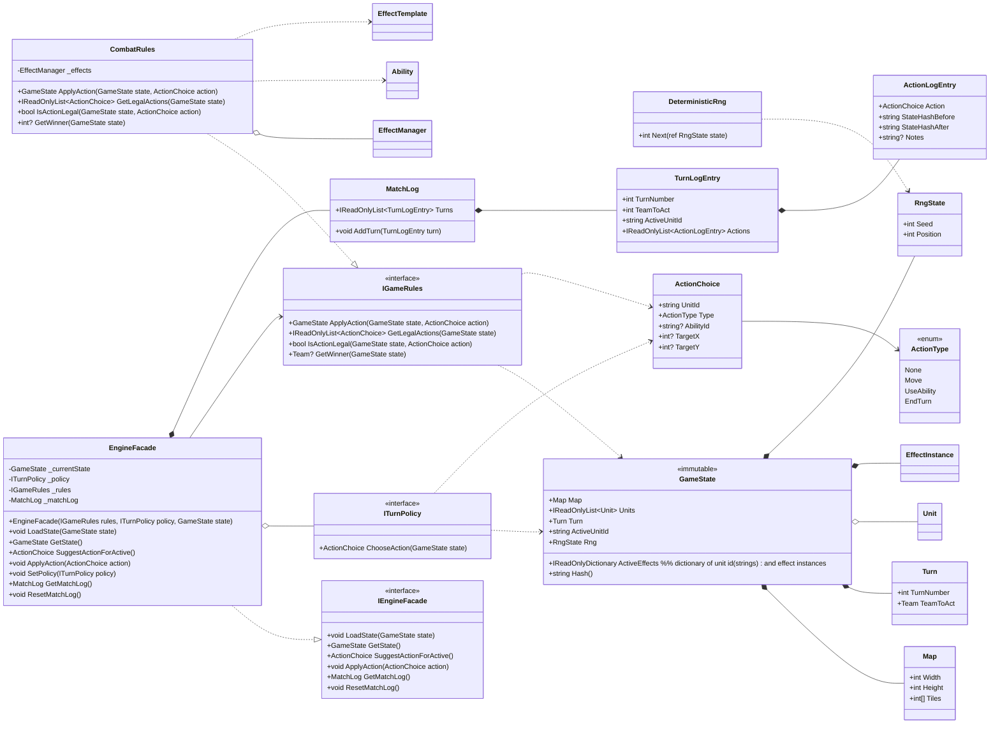

# core

```mermaid
classDiagram
    direction LR

    %% ============================================================
    %% CORE STATE (MAP, TURN, GAMESTATE, RNG)
    %% ============================================================

    class Map {
        +int Width
        +int Height
        +int[] Tiles
    }

    class Turn {
        +int TurnNumber
        +Team TeamToAct
    }

    class RngState {
        +int Seed
        +int Position
    }

    class DeterministicRng {
        +int Next(ref RngState state)
    }

    class GameState {
        <<immutable>>
        +Map Map
        +IReadOnlyList~Unit~ Units
        +IReadOnlyDictionary ActiveEffects %% dictionary of unit id (strings) and effect instances
        +Turn Turn
        +string ActiveUnitId
        +RngState Rng
        +string Hash()
    }

    %% GameState composition / associations
    GameState *-- Map
    GameState *-- Turn
    GameState o-- Unit
    GameState *-- EffectInstance
    GameState *-- RngState

    %% RNG usage relationships
    DeterministicRng ..> RngState
    %% uses RngState as input/output

    %% ============================================================
    %% RULES, ACTIONS, TURN POLICY
    %% ============================================================

    class ActionType {
        <<enum>>
        None
        Move
        UseAbility
        EndTurn
    }

    class ActionChoice {
        +string UnitId
        +ActionType Type
        +string? AbilityId
        +int? TargetX
        +int? TargetY
    }

    class IGameRules {
        <<interface>>
        +GameState ApplyAction(GameState state, ActionChoice action)
        +IReadOnlyList~ActionChoice~ GetLegalActions(GameState state)
        +bool IsActionLegal(GameState state, ActionChoice action)
        +Team? GetWinner(GameState state)
    }

    class CombatRules {
        +GameState ApplyAction(GameState state, ActionChoice action)
        +IReadOnlyList~ActionChoice~ GetLegalActions(GameState state)
        +bool IsActionLegal(GameState state, ActionChoice action)
        +int? GetWinner(GameState state)
        -EffectManager _effects
    }

    class ITurnPolicy {
        <<interface>>
        +ActionChoice ChooseAction(GameState state)
    }

    %% Rules / policy relationships
    CombatRules ..|> IGameRules
    CombatRules o-- EffectManager
    CombatRules ..> Ability
    CombatRules ..> EffectTemplate

    ActionChoice --> ActionType


    ITurnPolicy ..> GameState
    ITurnPolicy ..> ActionChoice

    IGameRules ..> GameState
    IGameRules ..> ActionChoice

    %% ============================================================
    %% PER-TURN LOGGING
    %% ============================================================

    class MatchLog {
        +IReadOnlyList~TurnLogEntry~ Turns
        +void AddTurn(TurnLogEntry turn)
    }

    class TurnLogEntry {
        +int TurnNumber
        +int TeamToAct
        +string ActiveUnitId
        +IReadOnlyList~ActionLogEntry~ Actions
    }

    class ActionLogEntry {
        +ActionChoice Action
        +string StateHashBefore
        +string StateHashAfter
        +string? Notes
    }

    %% Logging relationships
    MatchLog *-- TurnLogEntry
    TurnLogEntry *-- ActionLogEntry

    %% ============================================================
    %% ENGINE FACADE (ADAPTER BOUNDARY)
    %% ============================================================

    class IEngineFacade {
        <<interface>>
        +void LoadState(GameState state)
        +GameState GetState()
        +ActionChoice SuggestActionForActive()
        +void ApplyAction(ActionChoice action)
        +MatchLog GetMatchLog()
        +void ResetMatchLog()
    }

    class EngineFacade {
        -GameState _currentState
        -ITurnPolicy _policy
        -IGameRules _rules
        -MatchLog _matchLog

        +EngineFacade(IGameRules rules, ITurnPolicy policy, GameState state)
        +void LoadState(GameState state)
        +GameState GetState()
        +ActionChoice SuggestActionForActive()
        +void ApplyAction(ActionChoice action)
        +void SetPolicy(ITurnPolicy policy)
        +MatchLog GetMatchLog()
        +void ResetMatchLog()
    }

    %% Facade relationships
    EngineFacade ..|> IEngineFacade
    EngineFacade o-- ITurnPolicy
    EngineFacade --> IGameRules
    EngineFacade *-- MatchLog

```
