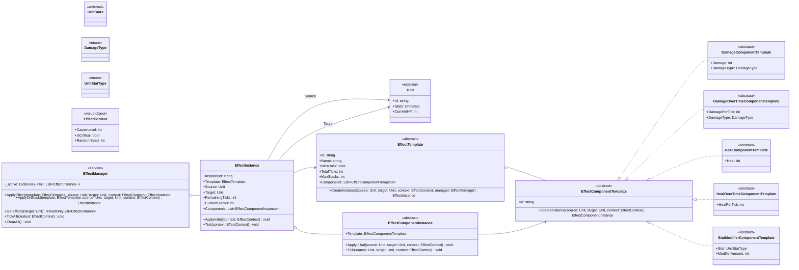

# effects

```mermaid
classDiagram
    direction LR

    %% CORE DOMAIN
    class Unit {
        <<external>>
        +Id: string
        +Stats: UnitStats
        +CurrentHP: int
    }

    class UnitStats {
        <<external>>
    }

    class DamageType {
        <<enum>>
    }

    class UnitStatType {
        <<enum>>
    }

    class EffectContext {
        <<value object>>
        +CasterLevel: int
        +IsCritical: bool
        +RandomSeed: int
    }

    %% ATOMIC COMPONENT TEMPLATES (STATIC)
    class DamageComponentTemplate {
        <<abstract>>
        +Damage: int
        +DamageType: DamageType
    }

    class DamageOverTimeComponentTemplate {
        <<abstract>>
        +DamagePerTick: int
        +DamageType: DamageType
    }

    class HealComponentTemplate {
        <<abstract>>
        +Heal: int
    }

    class HealOverTimeComponentTemplate {
        <<abstract>>
        +HealPerTick: int
    }

    class StatModifierComponentTemplate {
        <<abstract>>
        +Stat: UnitStatType
        +ModifierAmount: int
    }

    %% COMPONENT TEMPLATE (STATIC)
    class EffectComponentTemplate {
        <<abstract>>
        +Id: string
        +CreateInstance(source: Unit, target: Unit, context: EffectContext) EffectComponentInstance
    }

    EffectComponentTemplate <|.. DamageComponentTemplate
    EffectComponentTemplate <|.. DamageOverTimeComponentTemplate
    EffectComponentTemplate <|.. HealComponentTemplate
    EffectComponentTemplate <|.. HealOverTimeComponentTemplate
    EffectComponentTemplate <|.. StatModifierComponentTemplate


    %% EFFECT TEMPLATE (STATIC CONTAINER)
    %% EFFECT TEMPLATE (STATIC CONTAINER)
    class EffectTemplate {
        <<abstract>>
        +Id: string
        +Name: string
        +IsHarmful: bool
        +TotalTicks: int
        +MaxStacks: int
        +Components: List~EffectComponentTemplate~
        +CreateInstance(source: Unit, target: Unit, context: EffectContext, manager: EffectManager) EffectInstance
    }

    EffectTemplate o-- EffectComponentTemplate

    %% RUNTIME COMPONENT INSTANCE
    class EffectComponentInstance {
        <<abstract>>
        +Template: EffectComponentTemplate
        +ApplyInitial(source: Unit, target: Unit, context: EffectContext) void
        +Tick(source: Unit, target: Unit, context: EffectContext) void
    }

    EffectComponentInstance --> EffectComponentTemplate

    %% RUNTIME EFFECT INSTANCE (AGGREGATES COMPONENT INSTANCES)
    class EffectInstance {
        +InstanceId: string
        +Template: EffectTemplate
        +Source: Unit
        +Target: Unit
        +RemainingTicks: int
        +CurrentStacks: int
        +Components: List~EffectComponentInstance~
        +ApplyInitial(context: EffectContext) void
        +Tick(context: EffectContext) void
    }

    EffectInstance --> EffectTemplate
    EffectInstance --> Unit : Source
    EffectInstance --> Unit : Target
    EffectInstance o-- EffectComponentInstance

    %% MANAGER
    class EffectManager {
        <<service>>
        -_active: Dictionary~Unit, List~EffectInstance~~
        +ApplyEffect(template: EffectTemplate, source: Unit, target: Unit, context: EffectContext) EffectInstance
        +ApplyOrStack(template: EffectTemplate, source: Unit, target: Unit, context: EffectContext) EffectInstance
        +GetEffects(target: Unit) IReadOnlyList~EffectInstance~
        +TickAll(context: EffectContext) void
        +ClearAll() void
    }

    EffectManager o-- EffectInstance

```
