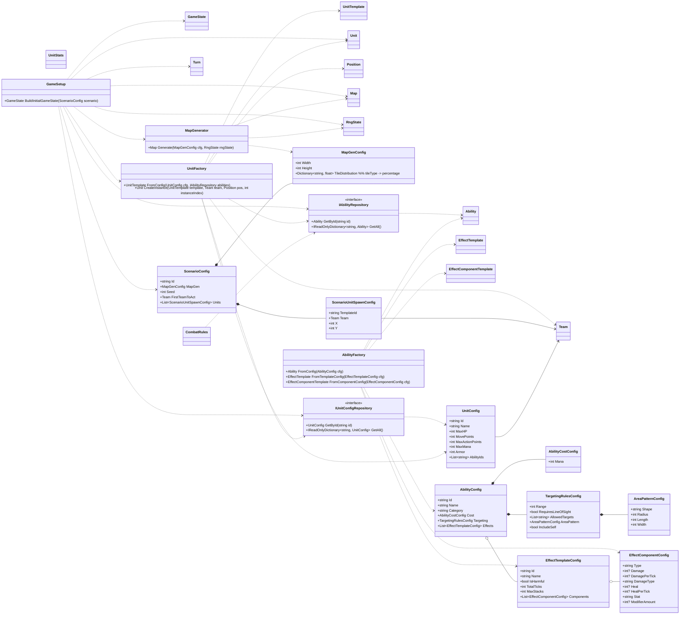

# setup_layer

```mermaid
classDiagram
    direction LR

    %% ============================================================
    %% EXTERNAL DOMAIN TYPES (DECLARED ELSEWHERE)
    %% ============================================================

    class Ability
    class EffectTemplate
    class EffectComponentTemplate
    class UnitTemplate
    class Unit
    class UnitStats
    class Team
    class Position
    class GameState
    class CombatRules
    class Map
    class RngState
    class Turn

    %% ============================================================
    %% JSON / DTO CONFIG TYPES (EDITED BY GA)
    %% ============================================================

    %% --- Abilities / Effects ---

    class AbilityConfig {
        +string Id
        +string Name
        +string Category
        +AbilityCostConfig Cost
        +TargetingRulesConfig Targeting
        +List~EffectTemplateConfig~ Effects
    }

    class AbilityCostConfig {
        +int Mana
    }

    class TargetingRulesConfig {
        +int Range
        +bool RequiresLineOfSight
        +List~string~ AllowedTargets
        +AreaPatternConfig AreaPattern
        +bool IncludeSelf
    }

    class AreaPatternConfig {
        +string Shape
        +int Radius
        +int Length
        +int Width
    }

    class EffectTemplateConfig {
        +string Id
        +string Name
        +bool IsHarmful
        +int TotalTicks
        +int MaxStacks
        +List~EffectComponentConfig~ Components
    }

    class EffectComponentConfig {
        +string Type
        +int? Damage
        +int? DamagePerTick
        +string DamageType
        +int? Heal
        +int? HealPerTick
        +string Stat
        +int? ModifierAmount
    }

    %% --- Units ---

    class UnitConfig {
        +string Id
        +string Name
        +int MaxHP
        +int MovePoints
        +int MaxActionPoints
        +int MaxMana
        +int Armor
        +List~string~ AbilityIds
    }

    %% --- Map generation ---

    class MapGenConfig {
        +int Width
        +int Height
        +Dictionary~string, float~ TileDistribution %% tileType -> percentage
    }

    %% --- Scenario (map + units + seed) ---

    class ScenarioUnitSpawnConfig {
        +string TemplateId
        +Team Team
        +int X
        +int Y
    }

    class ScenarioConfig {
        +string Id
        +MapGenConfig MapGen
        +int Seed
        +Team FirstTeamToAct
        +List~ScenarioUnitSpawnConfig~ Units
    }

    %% config relationships
    AbilityConfig *-- AbilityCostConfig
    AbilityConfig *-- TargetingRulesConfig
    AbilityConfig o-- EffectTemplateConfig

    TargetingRulesConfig *-- AreaPatternConfig
    EffectTemplateConfig o-- EffectComponentConfig

    UnitConfig --> Team

    ScenarioConfig *-- MapGenConfig
    ScenarioConfig *-- ScenarioUnitSpawnConfig
    ScenarioUnitSpawnConfig --> Team

    %% ============================================================
    %% FACTORIES / MAPPERS / GENERATORS (CONFIG -> DOMAIN)
    %% ============================================================

    class AbilityFactory {
        +Ability FromConfig(AbilityConfig cfg)
        +EffectTemplate FromTemplateConfig(EffectTemplateConfig cfg)
        +EffectComponentTemplate FromComponentConfig(EffectComponentConfig cfg)
    }

    class UnitFactory {
        +UnitTemplate FromConfig(UnitConfig cfg, IAbilityRepository abilities)
        +Unit CreateInstance(UnitTemplate template, Team team, Position pos, int instanceIndex)
    }

    class MapGenerator {
        +Map Generate(MapGenConfig cfg, RngState rngState)
    }

    class GameSetup {
        +GameState BuildInitialGameState(ScenarioConfig scenario)
    }

    %% factories / generators use both config and domain types
    AbilityFactory ..> AbilityConfig
    AbilityFactory ..> EffectTemplateConfig
    AbilityFactory ..> EffectComponentConfig
    AbilityFactory ..> Ability
    AbilityFactory ..> EffectTemplate
    AbilityFactory ..> EffectComponentTemplate

    UnitFactory ..> UnitConfig
    UnitFactory ..> UnitTemplate
    UnitFactory ..> Unit
    UnitFactory ..> Team
    UnitFactory ..> Position

    MapGenerator ..> MapGenConfig
    MapGenerator ..> Map
    MapGenerator ..> RngState

    GameSetup ..> ScenarioConfig
    GameSetup ..> GameState
    GameSetup ..> Map
    GameSetup ..> Unit
    GameSetup ..> Turn
    GameSetup ..> RngState

    %% ============================================================
    %% REPOSITORIES (DOMAIN OBJECT PROVIDERS)
    %% ============================================================

    class IAbilityRepository {
        <<interface>>
        +Ability GetById(string id)
        +IReadOnlyDictionary~string, Ability~ GetAll()
    }

    class IUnitConfigRepository {
        <<interface>>
        +UnitConfig GetById(string id)
        +IReadOnlyDictionary~string, UnitConfig~ GetAll()
    }

    %% repositories expose domain/config, not JSON details
    IAbilityRepository ..> Ability
    IUnitConfigRepository ..> UnitConfig

    %% ============================================================
    %% INTEGRATION WITH EXISTING DOMAIN
    %% ============================================================

    %% CombatRules needs access to abilities (by id) when applying actions
    CombatRules ..> IAbilityRepository

    %% UnitFactory needs unit configs and abilities to build UnitTemplate / Unit
    UnitFactory ..> IUnitConfigRepository
    UnitFactory ..> IAbilityRepository

    %% GameSetup orchestrates everything using repositories, factories, and generator
    GameSetup ..> IAbilityRepository
    GameSetup ..> IUnitConfigRepository
    GameSetup ..> UnitFactory
    GameSetup ..> MapGenerator

```
