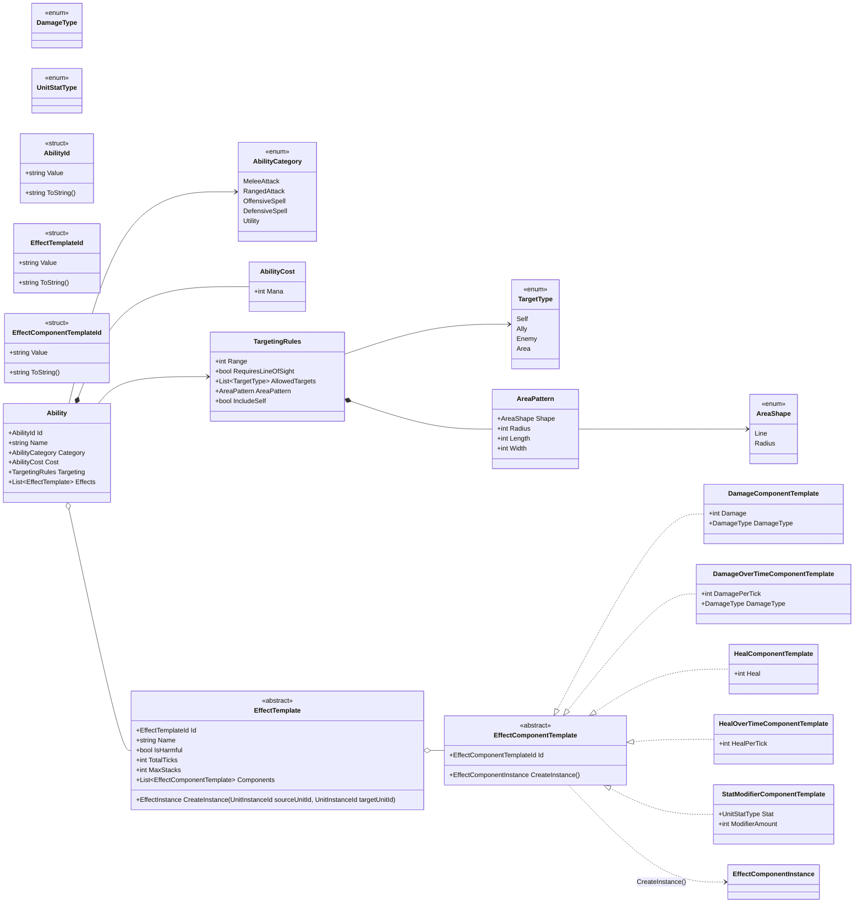

# abilities_effect_templates

```mermaid
classDiagram
    direction LR

    %% ============================================================
    %% CORE DOMAIN TYPES (REFERENCED BY EFFECTS)
    %% ============================================================

    class DamageType {
        <<enum>>
    }

    class UnitStatType {
        <<enum>>
    }

    class AbilityId {
        <<struct>>
        +string Value
        +string ToString()
    }

    class EffectTemplateId {
        <<struct>>
        +string Value
        +string ToString()
    }

    class EffectComponentTemplateId {
        <<struct>>
        +string Value
        +string ToString()
    }

    %% ============================================================
    %% ABILITIES & TARGETING (STATIC CONFIG)
    %% ============================================================

    class Ability {
        +AbilityId Id
        +string Name
        +AbilityCategory Category
        +AbilityCost Cost
        +TargetingRules Targeting
        +List~EffectTemplate~ Effects
        %% later: could be List~EffectTemplateId~ + repository
    }

    class AbilityCategory {
        <<enum>>
        MeleeAttack
        RangedAttack
        OffensiveSpell
        DefensiveSpell
        Utility
    }

    class AbilityCost {
        +int Mana
    }

    class TargetingRules {
        +int Range
        +bool RequiresLineOfSight
        +List~TargetType~ AllowedTargets
        +AreaPattern AreaPattern
        +bool IncludeSelf
    }

    class TargetType {
        <<enum>>
        Self
        Ally
        Enemy
        Area
    }

    class AreaPattern {
        +AreaShape Shape
        +int Radius
        +int Length
        +int Width
    }

    class AreaShape {
        <<enum>>
        Line
        Radius
    }

    Ability *-- AbilityCost
    Ability --> AbilityCategory
    Ability --> TargetingRules
    Ability o-- EffectTemplate

    TargetingRules --> TargetType
    TargetingRules *-- AreaPattern
    AreaPattern --> AreaShape

    %% ============================================================
    %% EFFECT COMPONENT TEMPLATES (STATIC)
    %% ============================================================

    class EffectComponentTemplate {
        <<abstract>>
        +EffectComponentTemplateId Id
        +EffectComponentInstance CreateInstance()
    }

    class DamageComponentTemplate {
        +int Damage
        +DamageType DamageType
    }

    class DamageOverTimeComponentTemplate {
        +int DamagePerTick
        +DamageType DamageType
    }

    class HealComponentTemplate {
        +int Heal
    }

    class HealOverTimeComponentTemplate {
        +int HealPerTick
    }

    class StatModifierComponentTemplate {
        +UnitStatType Stat
        +int ModifierAmount
    }

    EffectComponentTemplate <|.. DamageComponentTemplate
    EffectComponentTemplate <|.. DamageOverTimeComponentTemplate
    EffectComponentTemplate <|.. HealComponentTemplate
    EffectComponentTemplate <|.. HealOverTimeComponentTemplate
    EffectComponentTemplate <|.. StatModifierComponentTemplate

    EffectComponentTemplate ..> EffectComponentInstance : CreateInstance()

    %% ============================================================
    %% EFFECT TEMPLATES (STATIC CONTAINER)
    %% ============================================================

    class EffectTemplate {
        <<abstract>>
        +EffectTemplateId Id
        +string Name
        +bool IsHarmful
        +int TotalTicks
        +int MaxStacks
        +List~EffectComponentTemplate~ Components
        +EffectInstance CreateInstance(UnitInstanceId sourceUnitId, UnitInstanceId targetUnitId)
    }

    EffectTemplate o-- EffectComponentTemplate

```
