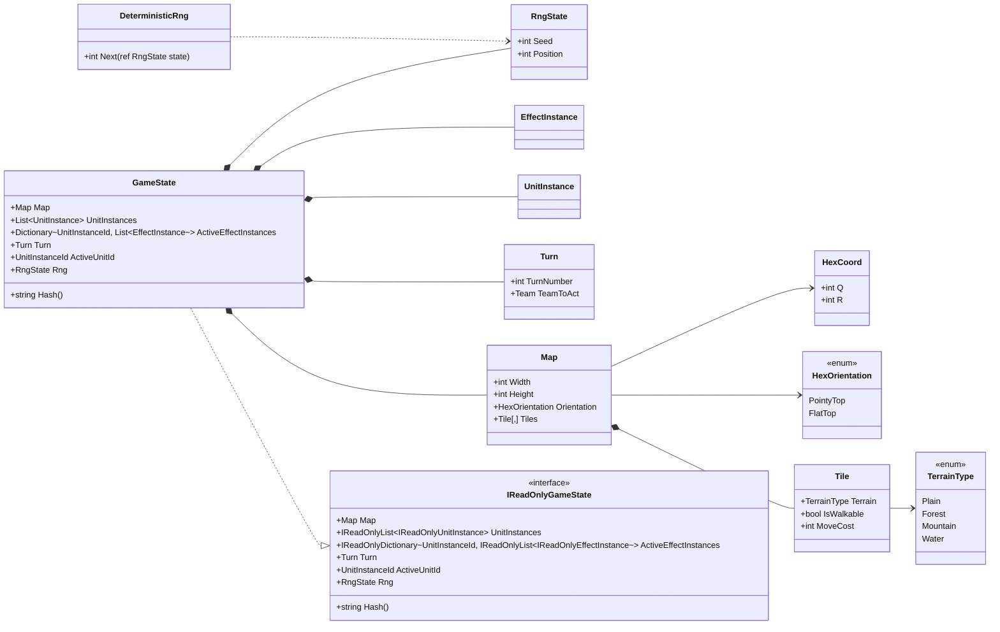

# core_state

```mermaid
classDiagram
    direction LR

    %% ============================================================
    %% CORE STATE (MAP, TURN, GAMESTATE, RNG)
    %% ============================================================

    class Map {
        +int Width
        +int Height
        +HexOrientation Orientation
        +Tile[,] Tiles
    }

    class Tile {
        +TerrainType Terrain
        +bool IsWalkable
        +int MoveCost
    }

    class HexCoord {
        +int Q
        +int R
    }

    class HexOrientation {
        <<enum>>
        PointyTop
        FlatTop
    }

    class TerrainType {
        <<enum>>
        Plain
        Forest
        Mountain
        Water
    }

    class Turn {
        +int TurnNumber
        +Team TeamToAct
    }

    class RngState {
        +int Seed
        +int Position
    }

    class DeterministicRng {
        +int Next(ref RngState state)
    }

    %% Read-only view over the game state
    class IReadOnlyGameState {
        <<interface>>
        +Map Map
        +IReadOnlyList~IReadOnlyUnitInstance~ UnitInstances
        +IReadOnlyDictionary~UnitInstanceId, IReadOnlyList~IReadOnlyEffectInstance~~ ActiveEffectInstances
        +Turn Turn
        +UnitInstanceId ActiveUnitId
        +RngState Rng
        +string Hash()
    }

    class GameState {
        +Map Map
        +List~UnitInstance~ UnitInstances
        +Dictionary~UnitInstanceId, List~EffectInstance~~ ActiveEffectInstances
        +Turn Turn
        +UnitInstanceId ActiveUnitId
        +RngState Rng
        +string Hash()
    }

    %% GameState implements the read-only interface
    GameState ..|> IReadOnlyGameState

    %% Map / tile graph
    Map *-- Tile
    Map --> HexOrientation
    Tile --> TerrainType
    Map --> HexCoord

    %% GameState composition / associations
    GameState *-- Map
    GameState *-- Turn
    GameState *-- UnitInstance
    GameState *-- EffectInstance
    GameState *-- RngState

    %% RNG usage relationships
    DeterministicRng ..> RngState

```
