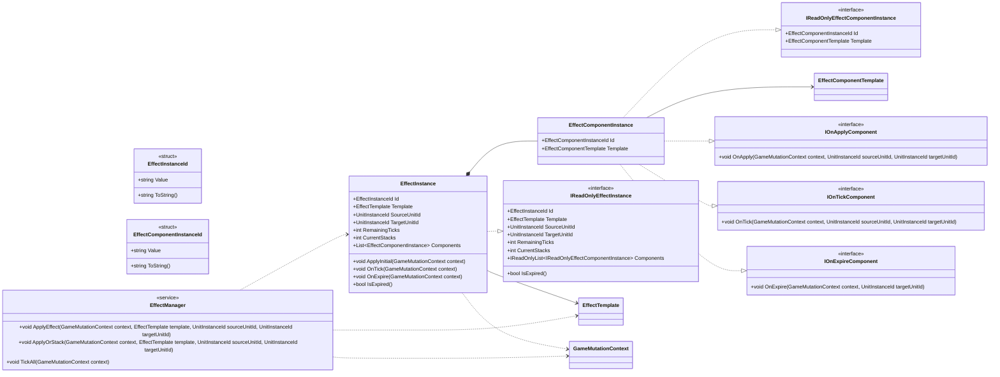

# effects_runtime

```mermaid
classDiagram
    direction LR

    %% ==========================================
    %% RUNTIME ID TYPES
    %% ==========================================

    class EffectInstanceId {
        <<struct>>
        +string Value
        +string ToString()
    }

    class EffectComponentInstanceId {
        <<struct>>
        +string Value
        +string ToString()
    }

    %% ==========================================
    %% RUNTIME EFFECT COMPONENT INSTANCES (READ-ONLY + MUTABLE)
    %% ==========================================

    class IReadOnlyEffectComponentInstance {
        <<interface>>
        +EffectComponentInstanceId Id
        +EffectComponentTemplate Template
    }

    class EffectComponentInstance {
        +EffectComponentInstanceId Id
        +EffectComponentTemplate Template
    }

    EffectComponentInstance ..|> IReadOnlyEffectComponentInstance

    %% Hook interfaces for behavior
    class IOnApplyComponent {
        <<interface>>
        +void OnApply(GameMutationContext context, UnitInstanceId sourceUnitId, UnitInstanceId targetUnitId)
    }

    class IOnTickComponent {
        <<interface>>
        +void OnTick(GameMutationContext context, UnitInstanceId sourceUnitId, UnitInstanceId targetUnitId)
    }

    class IOnExpireComponent {
        <<interface>>
        +void OnExpire(GameMutationContext context, UnitInstanceId targetUnitId)
    }

    EffectComponentInstance --> EffectComponentTemplate
    EffectComponentInstance ..|> IOnApplyComponent
    EffectComponentInstance ..|> IOnTickComponent
    EffectComponentInstance ..|> IOnExpireComponent

    %% ==========================================
    %% RUNTIME EFFECT INSTANCES (READ-ONLY + MUTABLE)
    %% ==========================================

    class IReadOnlyEffectInstance {
        <<interface>>
        +EffectInstanceId Id
        +EffectTemplate Template
        +UnitInstanceId SourceUnitId
        +UnitInstanceId TargetUnitId
        +int RemainingTicks
        +int CurrentStacks
        +IReadOnlyList~IReadOnlyEffectComponentInstance~ Components
        +bool IsExpired()
    }

    class EffectInstance {
        +EffectInstanceId Id
        +EffectTemplate Template
        +UnitInstanceId SourceUnitId
        +UnitInstanceId TargetUnitId
        +int RemainingTicks
        +int CurrentStacks
        +List~EffectComponentInstance~ Components
        +void ApplyInitial(GameMutationContext context)
        +void OnTick(GameMutationContext context)
        +void OnExpire(GameMutationContext context)
        +bool IsExpired()
    }

    EffectInstance ..|> IReadOnlyEffectInstance
    EffectInstance --> EffectTemplate
    EffectInstance *-- EffectComponentInstance
    EffectInstance ..> GameMutationContext

    %% ==========================================
    %% MANAGER & INTEGRATION WITH RULES
    %% ==========================================

    class EffectManager {
        <<service>>
        +void ApplyEffect(GameMutationContext context, EffectTemplate template, UnitInstanceId sourceUnitId, UnitInstanceId targetUnitId)
        +void ApplyOrStack(GameMutationContext context, EffectTemplate template, UnitInstanceId sourceUnitId, UnitInstanceId targetUnitId)
        +void TickAll(GameMutationContext context)
    }

    EffectManager ..> EffectInstance
    EffectManager ..> EffectTemplate
    EffectManager ..> GameMutationContext

```
