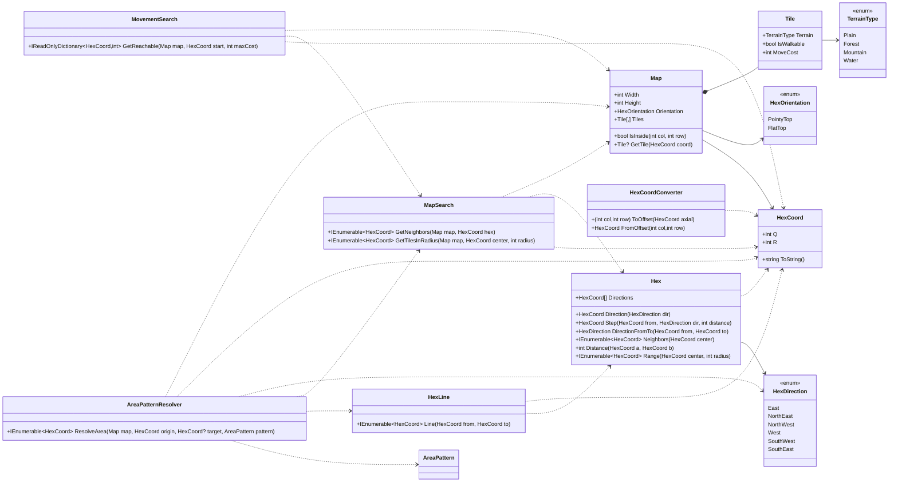

# map

```mermaid
classDiagram
    direction LR

    %% ==========================
    %% CORE HEX MAP MODEL
    %% ==========================

    class Map {
        +int Width
        +int Height
        +HexOrientation Orientation
        +Tile[,] Tiles
        +bool IsInside(int col, int row)
        +Tile? GetTile(HexCoord coord)
    }

    class Tile {
        +TerrainType Terrain
        +bool IsWalkable
        +int MoveCost
    }

    class HexCoord {
        +int Q
        +int R
        +string ToString()
    }

    class HexOrientation {
        <<enum>>
        PointyTop
        FlatTop
    }

    class TerrainType {
        <<enum>>
        Plain
        Forest
        Mountain
        Water
    }

    %% ==========================
    %% DIRECTIONS / BASIC HEX MATH
    %% ==========================

    class HexDirection {
        <<enum>>
        East
        NorthEast
        NorthWest
        West
        SouthWest
        SouthEast
    }

    class Hex {
        +HexCoord[] Directions
        +HexCoord Direction(HexDirection dir)
        +HexCoord Step(HexCoord from, HexDirection dir, int distance)
        +HexDirection DirectionFromTo(HexCoord from, HexCoord to)
        +IEnumerable~HexCoord~ Neighbors(HexCoord center)
        +int Distance(HexCoord a, HexCoord b)
        +IEnumerable~HexCoord~ Range(HexCoord center, int radius)
    }

    class HexCoordConverter {
        +(int col,int row) ToOffset(HexCoord axial)
        +HexCoord FromOffset(int col,int row)
    }

    %% ==========================
    %% SEARCH / MOVEMENT HELPERS
    %% ==========================

    class MapSearch {
        +IEnumerable~HexCoord~ GetNeighbors(Map map, HexCoord hex)
        +IEnumerable~HexCoord~ GetTilesInRadius(Map map, HexCoord center, int radius)
    }

    class MovementSearch {
        +IReadOnlyDictionary~HexCoord,int~ GetReachable(Map map, HexCoord start, int maxCost)
    }

    %% ==========================
    %% TARGETING / AREA HELPERS
    %% ==========================

    class HexLine {
        +IEnumerable~HexCoord~ Line(HexCoord from, HexCoord to)
    }

    class AreaPatternResolver {
        +IEnumerable~HexCoord~ ResolveArea( Map map, HexCoord origin, HexCoord? target, AreaPattern pattern)
    }

    %% ==========================
    %% CONNECTIONS
    %% ==========================

    %% Map and tiles
    Map *-- Tile
    Map --> HexOrientation
    Map --> HexCoord
    Tile --> TerrainType

    %% Hex math & directions
    Hex ..> HexCoord
    Hex --> HexDirection
    HexCoordConverter ..> HexCoord

    %% Search helpers
    MapSearch ..> Map
    MapSearch ..> Hex
    MapSearch ..> HexCoord

    MovementSearch ..> Map
    MovementSearch ..> MapSearch
    MovementSearch ..> HexCoord

    %% Targeting helpers
    HexLine ..> HexCoord
    HexLine ..> Hex

    AreaPatternResolver ..> Map
    AreaPatternResolver ..> HexCoord
    AreaPatternResolver ..> HexDirection
    AreaPatternResolver ..> MapSearch
    AreaPatternResolver ..> HexLine
    AreaPatternResolver ..> AreaPattern

```
