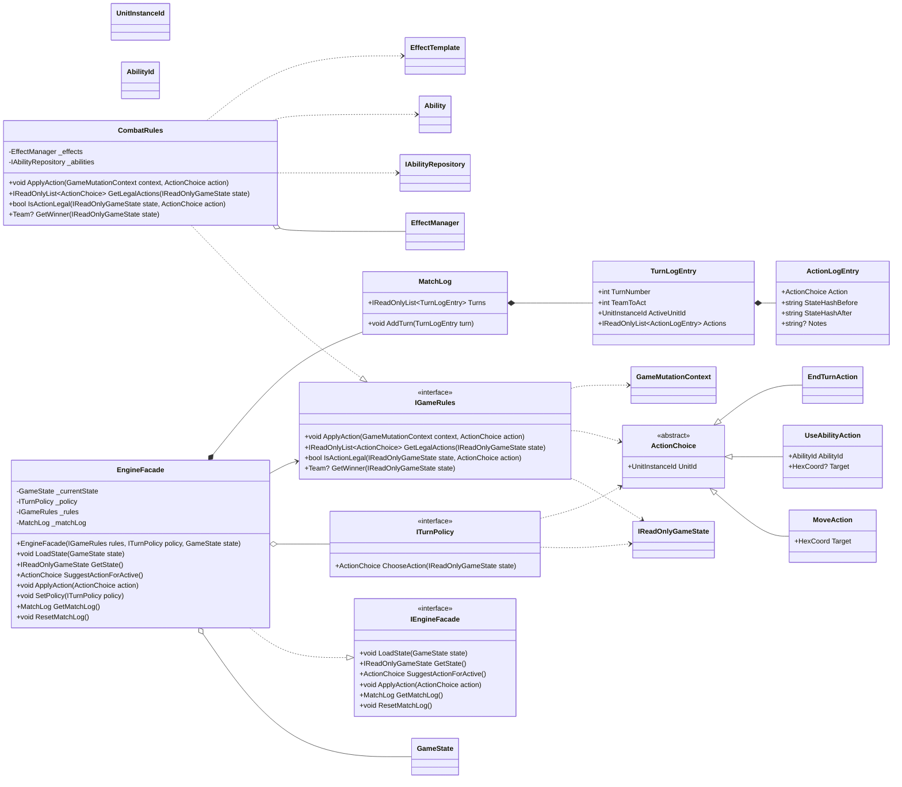

# rules_engine

```mermaid
classDiagram
    direction LR

    %% ==========================================
    %% REFERENCED CORE TYPES
    %% ==========================================

    class IReadOnlyGameState
    class GameMutationContext
    class UnitInstanceId
    class AbilityId
    class EffectManager

    %% ==========================================
    %% ACTIONS
    %% ==========================================

    class ActionChoice {
        <<abstract>>
        +UnitInstanceId UnitId
    }

    class MoveAction {
        +HexCoord Target
    }

    class UseAbilityAction {
        +AbilityId AbilityId
        +HexCoord? Target
    }

    class EndTurnAction {
    }

    ActionChoice <|-- MoveAction
    ActionChoice <|-- UseAbilityAction
    ActionChoice <|-- EndTurnAction

    %% ==========================================
    %% RULES & TURN POLICY
    %% ==========================================

    class IGameRules {
        <<interface>>
        +void ApplyAction(GameMutationContext context, ActionChoice action)
        +IReadOnlyList~ActionChoice~ GetLegalActions(IReadOnlyGameState state)
        +bool IsActionLegal(IReadOnlyGameState state, ActionChoice action)
        +Team? GetWinner(IReadOnlyGameState state)
    }

    class CombatRules {
        +void ApplyAction(GameMutationContext context, ActionChoice action)
        +IReadOnlyList~ActionChoice~ GetLegalActions(IReadOnlyGameState state)
        +bool IsActionLegal(IReadOnlyGameState state, ActionChoice action)
        +Team? GetWinner(IReadOnlyGameState state)
        -EffectManager _effects
        -IAbilityRepository _abilities
    }

    class ITurnPolicy {
        <<interface>>
        +ActionChoice ChooseAction(IReadOnlyGameState state)
    }

    CombatRules ..|> IGameRules
    CombatRules o-- EffectManager
    CombatRules ..> IAbilityRepository
    CombatRules ..> Ability
    CombatRules ..> EffectTemplate
    
    IGameRules ..> IReadOnlyGameState
    ITurnPolicy ..> IReadOnlyGameState

    ITurnPolicy ..> ActionChoice
    IGameRules ..> ActionChoice
    IGameRules ..> GameMutationContext

    %% ==========================================
    %% PER-TURN LOGGING
    %% ==========================================

    class MatchLog {
        +IReadOnlyList~TurnLogEntry~ Turns
        +void AddTurn(TurnLogEntry turn)
    }

    class TurnLogEntry {
        +int TurnNumber
        +int TeamToAct
        +UnitInstanceId ActiveUnitId
        +IReadOnlyList~ActionLogEntry~ Actions
    }

    class ActionLogEntry {
        +ActionChoice Action
        +string StateHashBefore
        +string StateHashAfter
        +string? Notes
    }

    MatchLog *-- TurnLogEntry
    TurnLogEntry *-- ActionLogEntry

    %% ==========================================
    %% ENGINE FACADE (ADAPTER BOUNDARY)
    %% ==========================================

    class IEngineFacade {
        <<interface>>
        +void LoadState(GameState state)
        +IReadOnlyGameState GetState()
        +ActionChoice SuggestActionForActive()
        +void ApplyAction(ActionChoice action)
        +MatchLog GetMatchLog()
        +void ResetMatchLog()
    }

    class EngineFacade {
        -GameState _currentState
        -ITurnPolicy _policy
        -IGameRules _rules
        -MatchLog _matchLog

        +EngineFacade(IGameRules rules, ITurnPolicy policy, GameState state)
        +void LoadState(GameState state)
        +IReadOnlyGameState GetState()
        +ActionChoice SuggestActionForActive()
        +void ApplyAction(ActionChoice action)
        +void SetPolicy(ITurnPolicy policy)
        +MatchLog GetMatchLog()
        +void ResetMatchLog()
    }

    EngineFacade o-- GameState
    EngineFacade ..|> IEngineFacade
    EngineFacade o-- ITurnPolicy
    EngineFacade --> IGameRules
    EngineFacade *-- MatchLog

```
