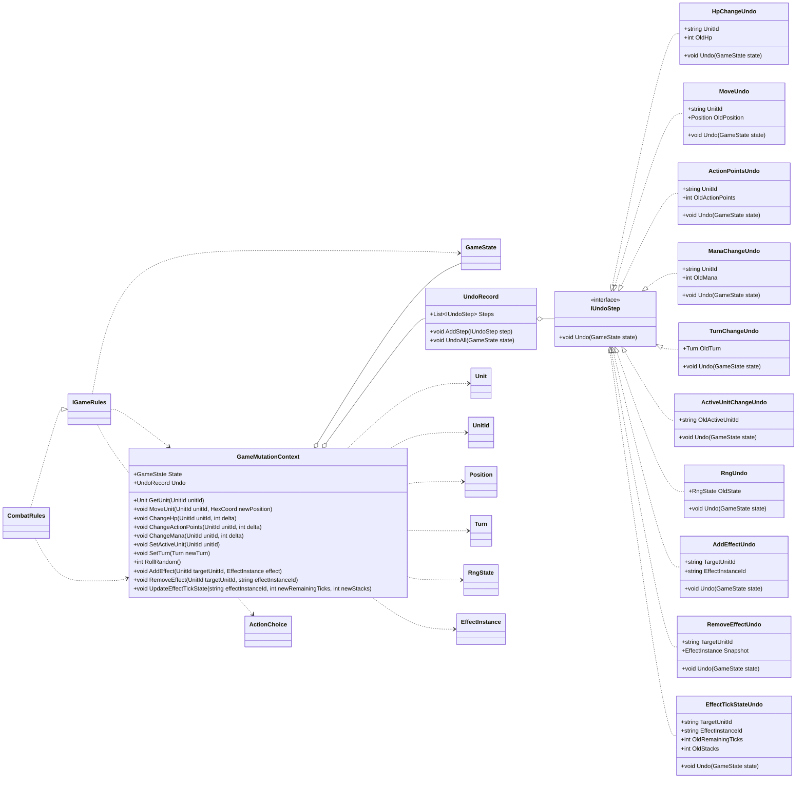

# undo_layer

```mermaid
classDiagram
    direction LR

    %% ==========================================
    %% UNDO CORE
    %% ==========================================

    class IUndoStep {
        <<interface>>
        +void Undo(GameState state)
    }

    class UndoRecord {
        +List~IUndoStep~ Steps
        +void AddStep(IUndoStep step)
        +void UndoAll(GameState state)
    }

    %% GameMutationContext as the single mutation + undo entry point

    class GameMutationContext {
        +GameState State
        +UndoRecord Undo

        %% mutation helpers (not exhaustive, but aligned with undo types)

        +Unit GetUnit(UnitId unitId)

        %% Position / movement
        +void MoveUnit(UnitId unitId, HexCoord newPosition)

        %% Resources / stats
        +void ChangeHp(UnitId unitId, int delta)
        +void ChangeActionPoints(UnitId unitId, int delta)
        +void ChangeMana(UnitId unitId, int delta)

        %% Turn / active unit
        +void SetActiveUnit(UnitId unitId)
        +void SetTurn(Turn newTurn)

        %% RNG
        +int RollRandom()

        %% Effects: lifecycle + ticking
        +void AddEffect(UnitId targetUnitId, EffectInstance effect)
        +void RemoveEffect(UnitId targetUnitId, string effectInstanceId)
        +void UpdateEffectTickState(string effectInstanceId, int newRemainingTicks, int newStacks)
    }

    %% ==========================================
    %% CONCRETE UNDO STEPS (EXAMPLES, NOT EXHAUSTIVE)
    %% ==========================================

    class HpChangeUndo {
        +string UnitId
        +int OldHp
        +void Undo(GameState state)
    }

    class MoveUndo {
        +string UnitId
        +Position OldPosition
        +void Undo(GameState state)
    }

    class ActionPointsUndo {
        +string UnitId
        +int OldActionPoints
        +void Undo(GameState state)
    }

    class ManaChangeUndo {
        +string UnitId
        +int OldMana
        +void Undo(GameState state)
    }

    class TurnChangeUndo {
        +Turn OldTurn
        +void Undo(GameState state)
    }

    class ActiveUnitChangeUndo {
        +string OldActiveUnitId
        +void Undo(GameState state)
    }

    class RngUndo {
        +RngState OldState
        +void Undo(GameState state)
    }

    %% Effect lifecycle

    class AddEffectUndo {
        +string TargetUnitId
        +string EffectInstanceId
        +void Undo(GameState state)
    }

    %% Used when an effect is removed (including expiry)
    class RemoveEffectUndo {
        +string TargetUnitId
        +EffectInstance Snapshot
        +void Undo(GameState state)
    }

    %% Used when ticking an effect (remaining ticks / stacks changed)
    class EffectTickStateUndo {
        +string TargetUnitId
        +string EffectInstanceId
        +int OldRemainingTicks
        +int OldStacks
        +void Undo(GameState state)
    }

    %% ==========================================
    %% RELATIONSHIPS
    %% ==========================================

    %% Undo record and steps
    UndoRecord o-- IUndoStep

    IUndoStep <|.. HpChangeUndo
    IUndoStep <|.. MoveUndo
    IUndoStep <|.. ActionPointsUndo
    IUndoStep <|.. ManaChangeUndo
    IUndoStep <|.. TurnChangeUndo
    IUndoStep <|.. ActiveUnitChangeUndo
    IUndoStep <|.. RngUndo
    IUndoStep <|.. AddEffectUndo
    IUndoStep <|.. RemoveEffectUndo
    IUndoStep <|.. EffectTickStateUndo

    %% Context usage
    GameMutationContext o-- GameState
    GameMutationContext o-- UndoRecord
    GameMutationContext ..> Unit
    GameMutationContext ..> UnitId
    GameMutationContext ..> Position
    GameMutationContext ..> Turn
    GameMutationContext ..> RngState
    GameMutationContext ..> EffectInstance

    %% Rules + context
    CombatRules ..|> IGameRules
    CombatRules ..> GameMutationContext

    IGameRules ..> GameState
    IGameRules ..> GameMutationContext
    IGameRules ..> ActionChoice

```
