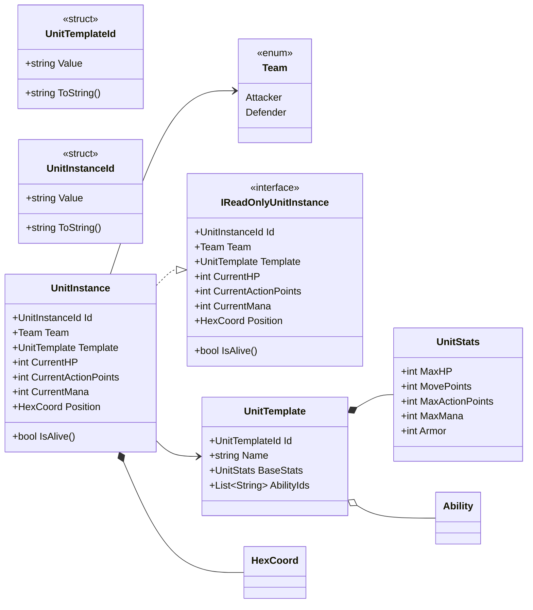

# unit

```mermaid
classDiagram
    direction LR

    class Team {
        <<enum>>
        Attacker
        Defender
    }

    class UnitTemplateId {
        <<struct>>
        +string Value
        +string ToString()
    }

    class UnitInstanceId {
        <<struct>>
        +string Value
        +string ToString()
    }

    %% Read-only view of a placed unit on the board
    class IReadOnlyUnitInstance {
        <<interface>>
        +UnitInstanceId Id
        +Team Team
        +UnitTemplate Template
        +int CurrentHP
        +int CurrentActionPoints
        +int CurrentMana
        +HexCoord Position
        +bool IsAlive()
    }

    %% Unit is a placed unit on the board (mutable runtime instance)
    class UnitInstance {
        +UnitInstanceId Id
        +Team Team
        +UnitTemplate Template
        +int CurrentHP
        +int CurrentActionPoints
        +int CurrentMana
        +HexCoord Position
        +bool IsAlive()
    }

    class UnitTemplate {
        +UnitTemplateId Id
        +string Name
        +UnitStats BaseStats
        +List~String~ AbilityIds
    }

    class UnitStats {
        +int MaxHP
        +int MovePoints
        +int MaxActionPoints
        +int MaxMana
        +int Armor
    }

    %% relationships
    UnitInstance *-- HexCoord
    UnitInstance --> Team
    UnitInstance --> UnitTemplate
    UnitTemplate *-- UnitStats
    UnitTemplate o-- Ability

    %% UnitInstance implements read-only interface
    UnitInstance ..|> IReadOnlyUnitInstance

```
