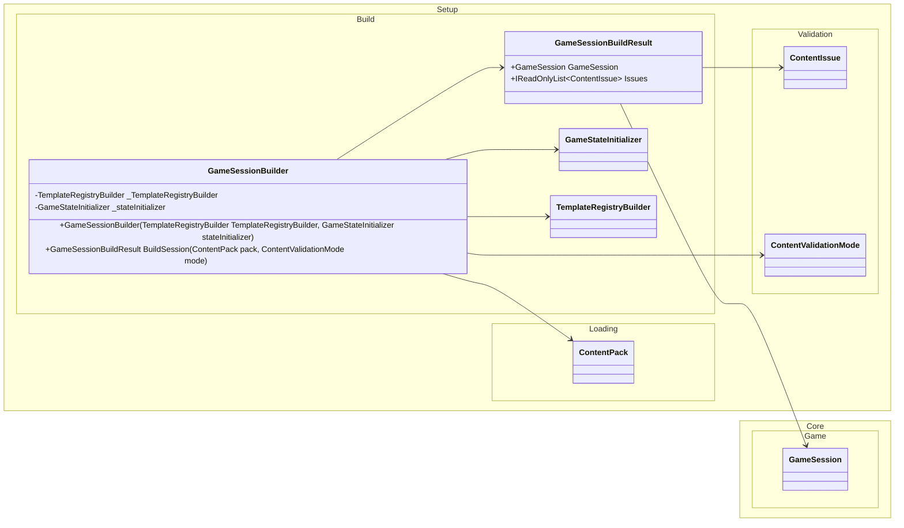

# GameSessionBuilder

```mermaid
classDiagram
direction LR

namespace Setup.Build{
  class GameSessionBuilder {
    -TemplateRegistryBuilder _TemplateRegistryBuilder
    -GameStateInitializer _stateInitializer
    +GameSessionBuilder(TemplateRegistryBuilder TemplateRegistryBuilder, GameStateInitializer stateInitializer)
    +GameSessionBuildResult BuildSession(ContentPack pack, ContentValidationMode mode)
  }

  class GameSessionBuildResult {
  +GameSession GameSession
  +IReadOnlyList~ContentIssue~ Issues
  }

  class GameStateInitializer
  class TemplateRegistryBuilder
}

namespace Setup.Loading{
  class ContentPack
}

namespace Setup.Validation{
  class ContentIssue
  class ContentValidationMode
}
  
namespace Core.Game{
  class GameSession
}

GameSessionBuilder --> TemplateRegistryBuilder
GameSessionBuilder --> GameStateInitializer
GameSessionBuilder --> GameSessionBuildResult
GameSessionBuildResult --> GameSession
GameSessionBuildResult --> ContentIssue
GameSessionBuilder --> ContentValidationMode
GameSessionBuilder --> ContentPack
```
