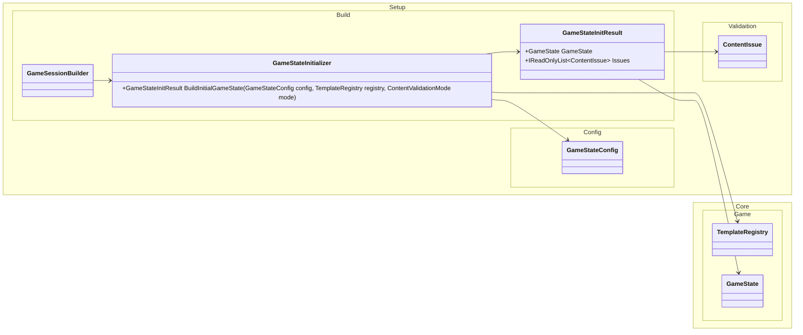

# GameStateInitializer

```mermaid
classDiagram
direction LR

namespace Setup.Build{
  class GameStateInitializer {
  +GameStateInitResult BuildInitialGameState(GameStateConfig config, TemplateRegistry registry, ContentValidationMode mode)
  }
  class GameStateInitResult {
    +GameState GameState
    +IReadOnlyList~ContentIssue~ Issues
  }
}
GameStateInitializer --> GameStateInitResult

namespace Setup.Build{
  class GameSessionBuilder
}
GameSessionBuilder --> GameStateInitializer


namespace Setup.Config{
  class GameStateConfig
}

GameStateInitializer --> GameStateConfig

namespace Core.Game{
  class TemplateRegistry
  class GameState
}

GameStateInitializer --> TemplateRegistry
GameStateInitResult --> GameState

namespace Setup.Validaition{
  class ContentIssue
}

GameStateInitResult --> ContentIssue

```
