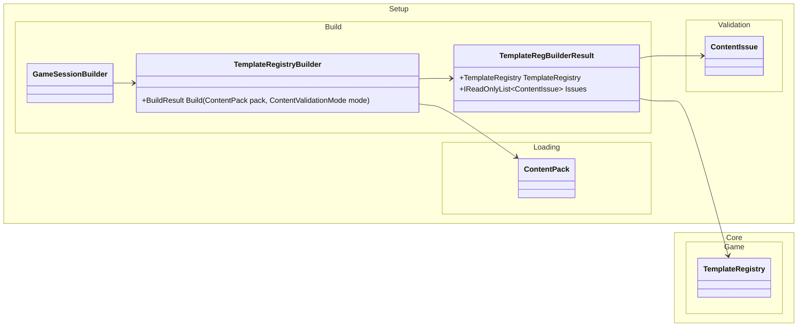

# TemplateRegistryBuilder

```mermaid
classDiagram
direction LR

namespace Setup.Build{
  class TemplateRegistryBuilder {
    +BuildResult Build(ContentPack pack, ContentValidationMode mode)
  }
  class TemplateRegBuilderResult {
    +TemplateRegistry TemplateRegistry
    +IReadOnlyList~ContentIssue~ Issues
  }
}

namespace Setup.Build {
  class GameSessionBuilder
}

GameSessionBuilder --> TemplateRegistryBuilder

namespace Setup.Loading{
  class ContentPack
}

namespace Setup.Validation{
  class ContentIssue
}

namespace Core.Game{
  class TemplateRegistry
}

TemplateRegistryBuilder --> ContentPack
TemplateRegistryBuilder --> TemplateRegBuilderResult
TemplateRegBuilderResult --> TemplateRegistry
TemplateRegBuilderResult --> ContentIssue
```
