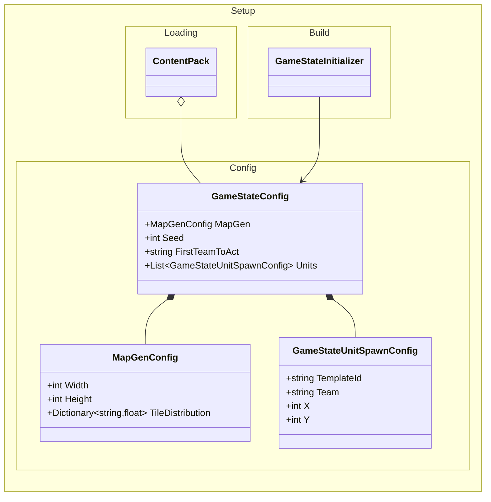

# GameStateConfig

```mermaid
classDiagram
direction LR
namespace Setup.Config{
  class GameStateConfig {
    +MapGenConfig MapGen
    +int Seed
    +string FirstTeamToAct
    +List~GameStateUnitSpawnConfig~ Units
  }

  class GameStateUnitSpawnConfig {
    +string TemplateId
    +string Team
    +int X
    +int Y
  }

  class MapGenConfig {
    +int Width
    +int Height
    +Dictionary~string,float~ TileDistribution
  }
}

GameStateConfig *-- MapGenConfig
GameStateConfig *-- GameStateUnitSpawnConfig


namespace Setup.Loading{
  class ContentPack
}
ContentPack o-- GameStateConfig


namespace Setup.Build{
  class GameStateInitializer
}

GameStateInitializer --> GameStateConfig


```
