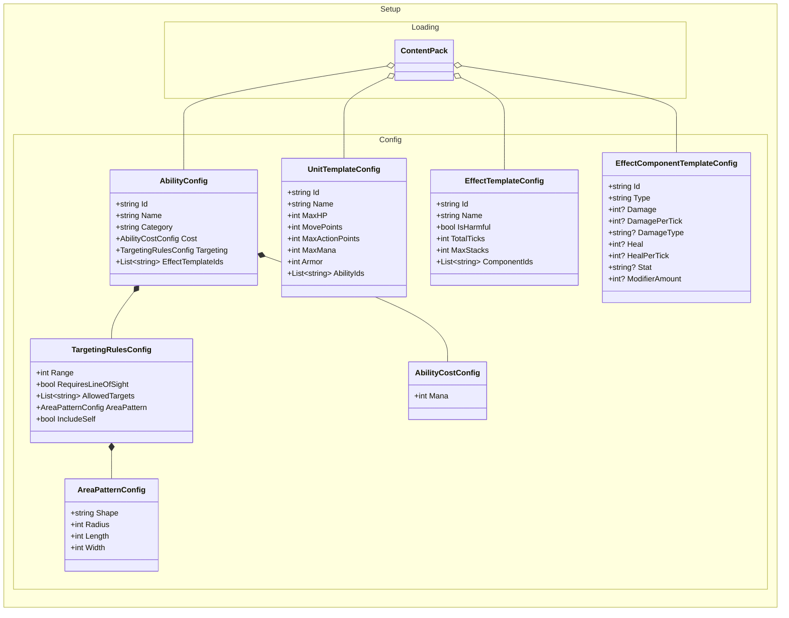

# Templates

```mermaid
classDiagram
direction LR

namespace Setup.Config{
class AbilityConfig {
  +string Id
  +string Name
  +string Category
  +AbilityCostConfig Cost
  +TargetingRulesConfig Targeting
  +List~string~ EffectTemplateIds
}

class AbilityCostConfig {
  +int Mana
}

class TargetingRulesConfig {
  +int Range
  +bool RequiresLineOfSight
  +List~string~ AllowedTargets
  +AreaPatternConfig AreaPattern
  +bool IncludeSelf
}

class AreaPatternConfig {
  +string Shape
  +int Radius
  +int Length
  +int Width
}

class EffectTemplateConfig {
  +string Id
  +string Name
  +bool IsHarmful
  +int TotalTicks
  +int MaxStacks
  +List~string~ ComponentIds
}

class EffectComponentTemplateConfig {
  +string Id
  +string Type
  +int? Damage
  +int? DamagePerTick
  +string? DamageType
  +int? Heal
  +int? HealPerTick
  +string? Stat
  +int? ModifierAmount
}

class UnitTemplateConfig {
  +string Id
  +string Name
  +int MaxHP
  +int MovePoints
  +int MaxActionPoints
  +int MaxMana
  +int Armor
  +List~string~ AbilityIds
}

}

TargetingRulesConfig *-- AreaPatternConfig
AbilityConfig *-- AbilityCostConfig
AbilityConfig *-- TargetingRulesConfig

namespace Setup.Loading{
  class ContentPack
}

ContentPack o-- UnitTemplateConfig
ContentPack o-- AbilityConfig
ContentPack o-- EffectTemplateConfig
ContentPack o-- EffectComponentTemplateConfig

```
