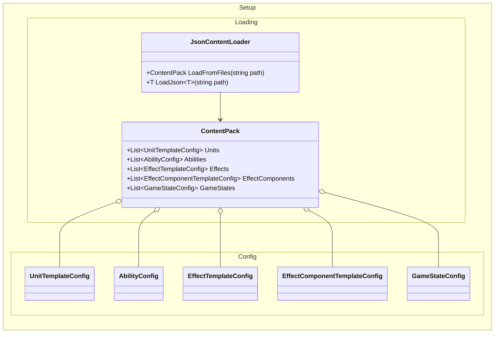

# JsonContentLoader

```mermaid
classDiagram
direction LR

namespace Setup.Loading{
  class JsonContentLoader {
    +ContentPack LoadFromFiles(string path)
    +T LoadJson~T~(string path)
  }

  class ContentPack {
    +List~UnitTemplateConfig~ Units
    +List~AbilityConfig~ Abilities
    +List~EffectTemplateConfig~ Effects
    +List~EffectComponentTemplateConfig~ EffectComponents
    +List~GameStateConfig~ GameStates
  }
}

JsonContentLoader --> ContentPack

namespace Setup.Config{
  class UnitTemplateConfig
  class AbilityConfig
  class EffectTemplateConfig
  class EffectComponentTemplateConfig
  class GameStateConfig
}

ContentPack o-- UnitTemplateConfig
ContentPack o-- AbilityConfig
ContentPack o-- EffectTemplateConfig
ContentPack o-- EffectComponentTemplateConfig
ContentPack o-- GameStateConfig
```
