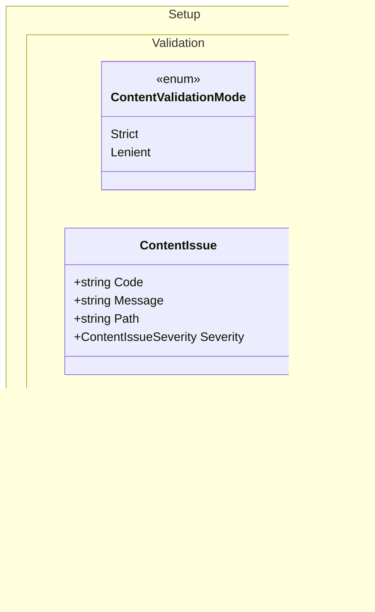

# Validation

```mermaid
classDiagram
direction LR

namespace Setup.Validation{
    class ContentValidationMode {
    <<enum>>
    Strict
    Lenient
    }

    class ContentIssue {
    +string Code
    +string Message
    +string Path
    +ContentIssueSeverity Severity
    }

    class ContentIssueSeverity {
    <<enum>>
    Warning
    Error
    }
}
```
