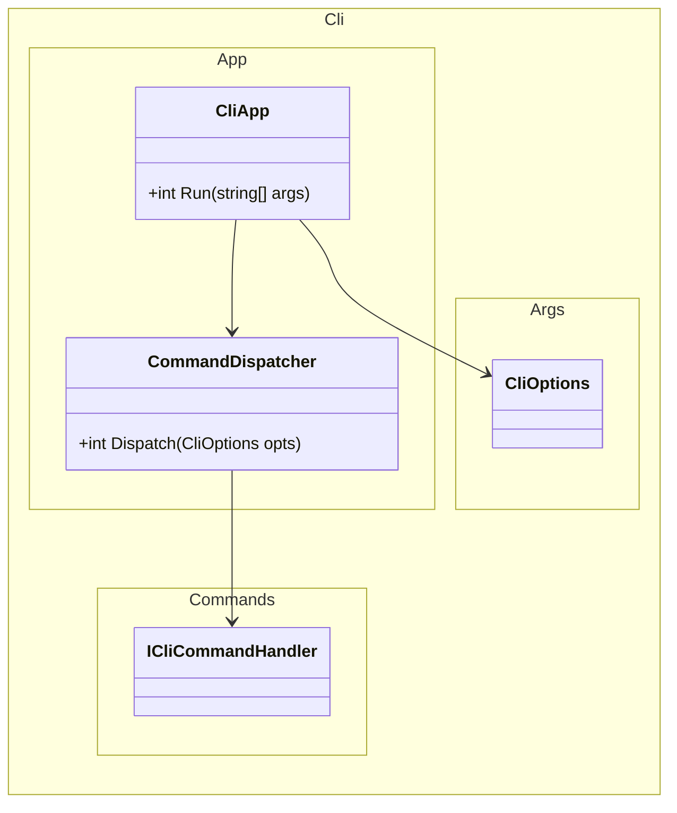

# App

```mermaid
classDiagram
direction LR

namespace Cli.App {
  class CliApp {
    +int Run(string[] args)
  }

  class CommandDispatcher {
    +int Dispatch(CliOptions opts)
  }
}

CliApp --> CommandDispatcher

namespace Cli.Args{
    class CliOptions
}

CliApp --> CliOptions

namespace Cli.Commands{
    class ICliCommandHandler
}

CommandDispatcher --> ICliCommandHandler
```
