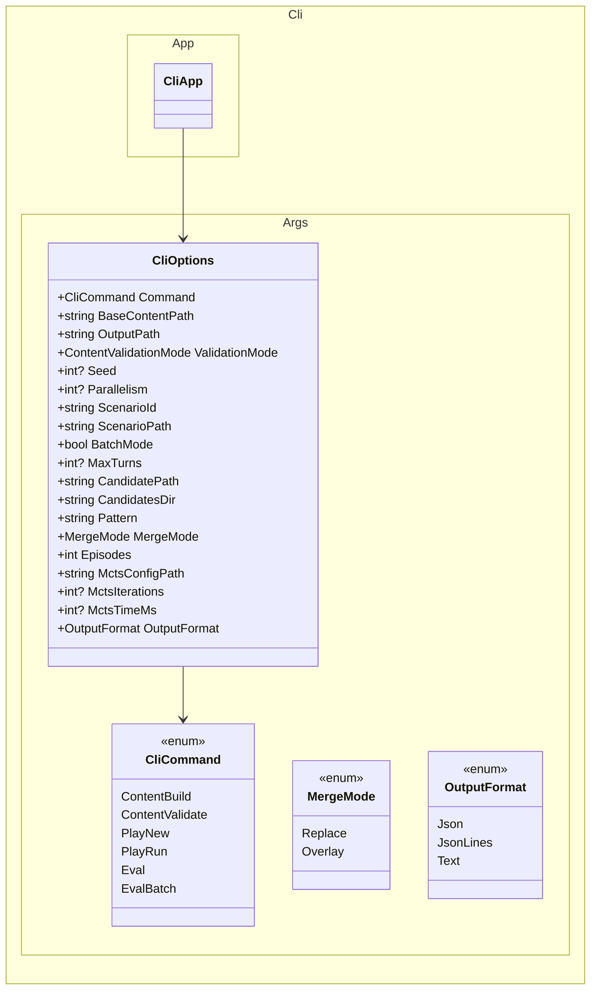

# Args

```mermaid
classDiagram
direction LR

namespace Cli.Args {
  class CliCommand {
    <<enum>>
    ContentBuild
    ContentValidate
    PlayNew
    PlayRun
    Eval
    EvalBatch
  }

  class CliOptions {
    +CliCommand Command

    +string BaseContentPath
    +string OutputPath
    +ContentValidationMode ValidationMode
    +int? Seed
    +int? Parallelism

    +string ScenarioId
    +string ScenarioPath
    +bool BatchMode
    +int? MaxTurns

    +string CandidatePath
    +string CandidatesDir
    +string Pattern
    +MergeMode MergeMode
    +int Episodes
    +string MctsConfigPath
    +int? MctsIterations
    +int? MctsTimeMs
    +OutputFormat OutputFormat
  }

  class MergeMode {
    <<enum>>
    Replace
    Overlay
  }

  class OutputFormat {
    <<enum>>
    Json
    JsonLines
    Text
  }
}

CliOptions --> CliCommand

namespace Cli.App{
  class CliApp
}
CliApp --> CliOptions

```
