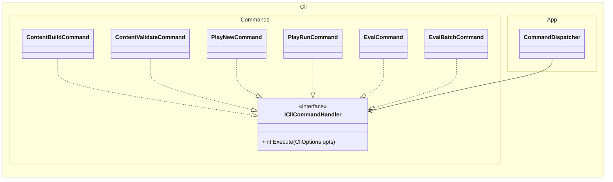

# ICliCommandHandler

```mermaid
classDiagram
direction LR

%% ============================================================
%% CLI COMMAND HANDLERS
%% ============================================================

namespace Cli.Commands {
  class ICliCommandHandler {
    <<interface>>
    +int Execute(CliOptions opts)
  }

  class ContentBuildCommand
  class ContentValidateCommand
  class PlayNewCommand
  class PlayRunCommand
  class EvalCommand
  class EvalBatchCommand
}

ContentBuildCommand ..|> ICliCommandHandler
ContentValidateCommand ..|> ICliCommandHandler
PlayNewCommand ..|> ICliCommandHandler
PlayRunCommand ..|> ICliCommandHandler
EvalCommand ..|> ICliCommandHandler
EvalBatchCommand ..|> ICliCommandHandler

namespace Cli.App {
  class CommandDispatcher
}

CommandDispatcher --> ICliCommandHandler
```
