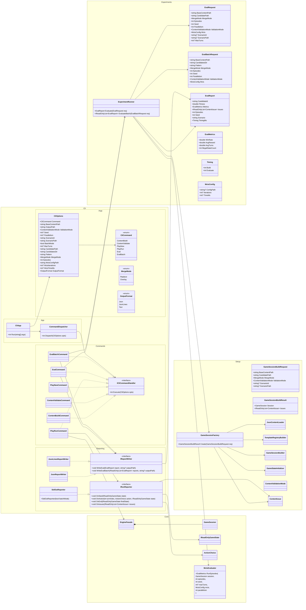

# cli-new

```mermaid
classDiagram
direction LR

%% ============================================================
%% CLI APP / ROUTING
%% ============================================================

namespace Cli.App {
  class CliApp {
    +int Run(string[] args)
  }

  class CommandDispatcher {
    +int Dispatch(CliOptions opts)
  }
}

namespace Cli.Args {
  class CliCommand {
    <<enum>>
    ContentBuild
    ContentValidate
    PlayNew
    PlayRun
    Eval
    EvalBatch
  }

  class CliOptions {
    +CliCommand Command

    +string BaseContentPath
    +string OutputPath
    +ContentValidationMode ValidationMode
    +int? Seed
    +int? Parallelism

    +string ScenarioId
    +string ScenarioPath
    +bool BatchMode
    +int? MaxTurns

    +string CandidatePath
    +string CandidatesDir
    +string Pattern
    +MergeMode MergeMode
    +int Episodes
    +string MctsConfigPath
    +int? MctsIterations
    +int? MctsTimeMs
    +OutputFormat OutputFormat
  }

  class MergeMode {
    <<enum>>
    Replace
    Overlay
  }

  class OutputFormat {
    <<enum>>
    Json
    JsonLines
    Text
  }
}

CliApp --> CommandDispatcher
CliApp --> CliOptions
CliOptions --> CliCommand

%% ============================================================
%% CLI COMMAND HANDLERS
%% ============================================================

namespace Cli.Commands {
  class ICliCommandHandler {
    <<interface>>
    +int Execute(CliOptions opts)
  }

  class ContentBuildCommand
  class ContentValidateCommand
  class PlayNewCommand
  class PlayRunCommand
  class EvalCommand
  class EvalBatchCommand
}

ContentBuildCommand ..|> ICliCommandHandler
ContentValidateCommand ..|> ICliCommandHandler
PlayNewCommand ..|> ICliCommandHandler
PlayRunCommand ..|> ICliCommandHandler
EvalCommand ..|> ICliCommandHandler
EvalBatchCommand ..|> ICliCommandHandler

CommandDispatcher --> ICliCommandHandler

%% ============================================================
%% REPORTING / OUTPUT
%% ============================================================

namespace Cli.Reporting {
  class IRunReporter {
    <<interface>>
    +void OnStart(IReadOnlyGameState state)
    +void OnAction(int turnIndex, ActionChoice action, IReadOnlyGameState state)
    +void OnEnd(IReadOnlyGameState finalState)
    +void OnIssues(IReadOnlyList~ContentIssue~ issues)
  }

  class StdOutReporter {
    +StdOutReporter(bool batchMode)
  }

  class IReportWriter {
    <<interface>>
    +void WriteEval(EvalReport report, string? outputPath)
    +void WriteEvalBatch(IReadOnlyList~EvalReport~ reports, string? outputPath)
  }

  class JsonReportWriter
  class JsonLinesReportWriter
}

StdOutReporter ..|> IRunReporter
JsonReportWriter ..|> IReportWriter
JsonLinesReportWriter ..|> IReportWriter

PlayRunCommand --> IRunReporter
EvalCommand --> IReportWriter
EvalBatchCommand --> IReportWriter

%% ============================================================
%% EXPERIMENT / EVALUATION
%% ============================================================

namespace Experiments {
  class ExperimentRunner {
    +EvalReport Evaluate(EvalRequest req)
    +IReadOnlyList~EvalReport~ EvaluateBatch(EvalBatchRequest req)
  }

  class EvalRequest {
    +string BaseContentPath
    +string CandidatePath
    +MergeMode MergeMode
    +int Episodes
    +int Seed
    +int Parallelism
    +ContentValidationMode ValidationMode
    +MctsConfig Mcts
    +string? ScenarioId
    +string? ScenarioPath
    +int? MaxTurns
  }

  class EvalBatchRequest {
    +string BaseContentPath
    +string CandidatesDir
    +string Pattern
    +MergeMode MergeMode
    +int Episodes
    +int Seed
    +int Parallelism
    +ContentValidationMode ValidationMode
    +MctsConfig Mcts
  }

  class EvalReport {
    +string CandidateId
    +double Fitness
    +EvalMetrics Metrics
    +IReadOnlyList~ContentIssue~ Issues
    +int Episodes
    +int Seed
    +string Scenario
    +Timing TimingMs
  }

  class EvalMetrics {
    +double WinRate
    +double AvgReward
    +double AvgTurns
    +int IllegalStateCount
  }

  class Timing {
    +int Build
    +int Evaluate
  }

  class MctsConfig {
    +string? ConfigPath
    +int? Iterations
    +int? TimeMs
  }
}

EvalCommand --> ExperimentRunner
EvalBatchCommand --> ExperimentRunner
ExperimentRunner --> EvalRequest
ExperimentRunner --> EvalBatchRequest
ExperimentRunner --> EvalReport

%% ============================================================
%% SETUP PIPELINE
%% ============================================================

namespace Setup {
  class GameSessionFactory {
    +GameSessionBuildResult Create(GameSessionBuildRequest req)
  }

  class GameSessionBuildRequest {
    +string BaseContentPath
    +string CandidatePath
    +MergeMode MergeMode
    +ContentValidationMode ValidationMode
    +string? ScenarioId
    +string? ScenarioPath
  }

  class GameSessionBuildResult {
    +GameSession Session
    +IReadOnlyList~ContentIssue~ Issues
  }

  class JsonContentLoader
  class TemplateRegistryBuilder
  class GameSessionBuilder
  class GameStateInitializer
  class ContentValidationMode
  class ContentIssue
}

ExperimentRunner --> GameSessionFactory
GameSessionFactory --> JsonContentLoader
GameSessionFactory --> TemplateRegistryBuilder
GameSessionFactory --> GameSessionBuilder
GameSessionFactory --> GameStateInitializer
GameSessionFactory --> ContentIssue

%% ============================================================
%% CORE ENGINE + MCTS
%% ============================================================

namespace Core {
  class EngineFacade
  class GameSession
  class IReadOnlyGameState
  class ActionChoice

  class MctsEvaluator {
    +EvalMetrics RunEpisodes(
      GameSession session,
      int episodes,
      int seed,
      int? maxTurns,
      MctsConfig mcts,
      int parallelism
    )
  }
}

ExperimentRunner --> MctsEvaluator
PlayRunCommand --> EngineFacade
EngineFacade *-- GameSession

IRunReporter --> IReadOnlyGameState
IRunReporter --> ActionChoice
IRunReporter --> ContentIssue
IReportWriter --> EvalReport

```
