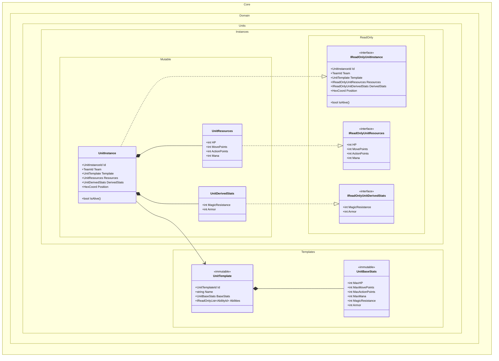

# Unit

```mermaid
%%{init: {'themeVariables': { 'fontSize': '10px' }}}%%

classDiagram
direction LR

%% ============================================================
%% UNITS DOMAIN (TEMPLATES + RUNTIME INSTANCES)
%% Templates are immutable static content.
%% Instances are runtime match state (mutable), exposed publicly via read-only views.
%% ============================================================

%% ------------------------------
%% Runtime instances (read-only contract)
%% ------------------------------
namespace Core.Domain.Units.Instances.ReadOnly {
  class IReadOnlyUnitInstance {
    <<interface>>
    +UnitInstanceId Id
    +TeamId Team
    +UnitTemplate Template
    +IReadOnlyUnitResources Resources
    +IReadOnlyUnitDerivedStats DerivedStats
    +HexCoord Position
    +bool IsAlive()
  }

  class IReadOnlyUnitResources {
    <<interface>>
    +int HP
    +int MovePoints
    +int ActionPoints
    +int Mana
  }

  class IReadOnlyUnitDerivedStats {
    <<interface>>
    +int MagicResistance
    +int Armor
  }
}

%% ------------------------------
%% Runtime instances (mutable state)
%% ------------------------------
namespace Core.Domain.Units.Instances.Mutable {
  class UnitInstance {
    +UnitInstanceId Id
    +TeamId Team
    +UnitTemplate Template
    +UnitResources Resources
    +UnitDerivedStats DerivedStats
    +HexCoord Position
    +bool IsAlive()
  }

  class UnitResources {
    +int HP
    +int MovePoints
    +int ActionPoints
    +int Mana
  }

  class UnitDerivedStats {
    +int MagicResistance
    +int Armor
  }

}

UnitInstance --> UnitTemplate
UnitInstance *-- UnitResources
UnitInstance *-- UnitDerivedStats
UnitInstance ..|> IReadOnlyUnitInstance
UnitResources ..|> IReadOnlyUnitResources
UnitDerivedStats ..|> IReadOnlyUnitDerivedStats


%% ------------------------------
%% Templates (immutable static content)
%% ------------------------------
namespace Core.Domain.Units.Templates {
  class UnitTemplate {
    <<immutable>>
    +UnitTemplateId Id
    +string Name
    +UnitBaseStats BaseStats
    +IReadOnlyList~AbilityId~ Abilities
  }

  class UnitBaseStats {
    <<immutable>>
    +int MaxHP
    +int MaxMovePoints
    +int MaxActionPoints
    +int MaxMana
    +int MagicResistance
    +int Armor
  }
}

UnitTemplate *-- UnitBaseStats
```
