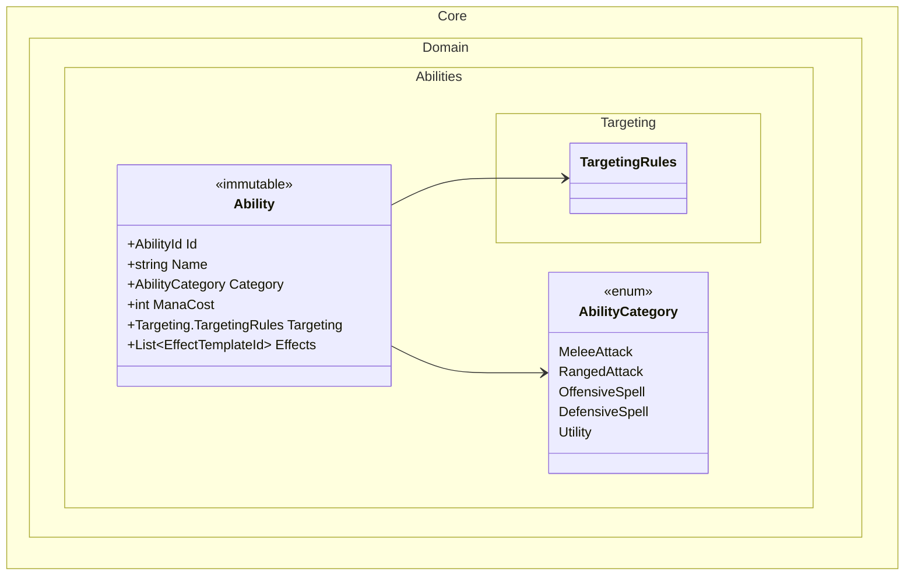

# Ability

```mermaid
classDiagram
direction LR

namespace Core.Domain.Abilities{
  class Ability {
    <<immutable>>
    +AbilityId Id
    +string Name
    +AbilityCategory Category
    +int ManaCost
    +Targeting.TargetingRules Targeting
    +List~EffectTemplateId~ Effects
  }

  class AbilityCategory {
    <<enum>>
    MeleeAttack
    RangedAttack
    OffensiveSpell
    DefensiveSpell
    Utility
  }
}

namespace Core.Domain.Abilities.Targeting{
	class TargetingRules
}


Ability --> AbilityCategory
Ability --> TargetingRules
```
