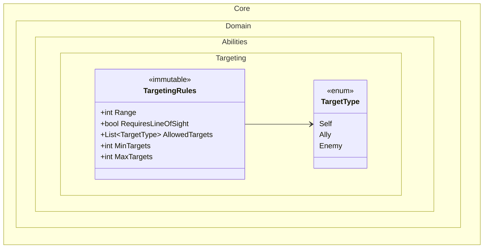

# TargetingRules

```mermaid
classDiagram
direction LR

namespace Core.Domain.Abilities.Targeting{
  class TargetingRules {
    <<immutable>>
    +int Range
    +bool RequiresLineOfSight
    +List~TargetType~ AllowedTargets
    +int MinTargets
    +int MaxTargets
  }

  class TargetType {
    <<enum>>
    Self
    Ally
    Enemy
  }
}

TargetingRules --> TargetType
```
