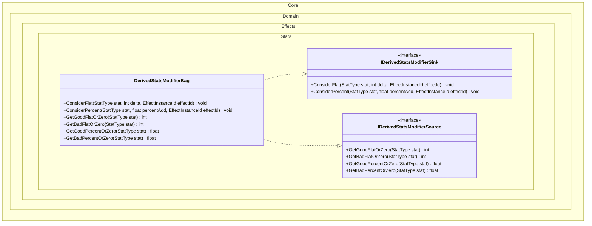

# DerivedStatsModifierBag

```mermaid
classDiagram
    direction LR


  %% ============================================================
  %% DERIVED STATS MODIFIER BAG
  %%
  %% Query-time dominance aggregator for DerivedStats recomputation
  %%
  %% Created per recomputation pass
  %% Written to by Effect component contributors
  %%
  %% Used by DerivedStatsCalculator to resolve final stat values
  %%
  %% Collects strongest buff and strongest debuff per StatType
  %% Separates flat deltas and percent-of-base deltas
  %%
  %% Buffs use MAX dominance
  %% Debuffs use MIN dominance
  %% Equal values resolved deterministically via EffectInstanceId
  %%
  %% Does not perform final stat math
  %% Does not mutate GameState
  %% ============================================================

namespace Core.Domain.Effects.Stats{
  class DerivedStatsModifierBag{
    +ConsiderFlat(StatType stat, int delta, EffectInstanceId effectId) void
    +ConsiderPercent(StatType stat, float percentAdd, EffectInstanceId effectId) void

    +GetGoodFlatOrZero(StatType stat) int
    +GetBadFlatOrZero(StatType stat) int
    +GetGoodPercentOrZero(StatType stat) float
    +GetBadPercentOrZero(StatType stat) float
  }

  class IDerivedStatsModifierSink{
    <<interface>>
    +ConsiderFlat(StatType stat, int delta, EffectInstanceId effectId) void
    +ConsiderPercent(StatType stat, float percentAdd, EffectInstanceId effectId) void
  }

  class IDerivedStatsModifierSource{
    <<interface>>
    +GetGoodFlatOrZero(StatType stat) int
    +GetBadFlatOrZero(StatType stat) int
    +GetGoodPercentOrZero(StatType stat) float
    +GetBadPercentOrZero(StatType stat) float
  }
}

DerivedStatsModifierBag ..|> IDerivedStatsModifierSink
DerivedStatsModifierBag ..|> IDerivedStatsModifierSource

```
