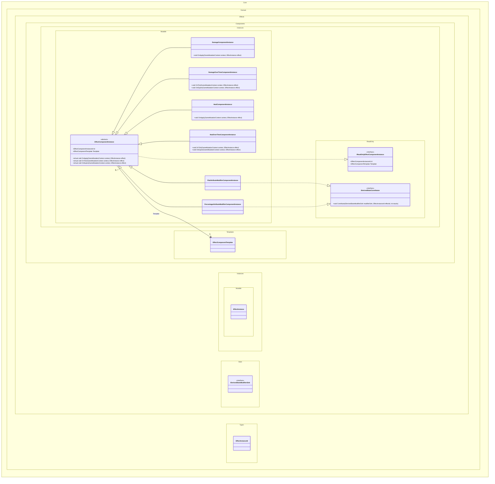

# EffectComponentInstance

```mermaid
%%{init: {'themeVariables': { 'fontSize': '8px' }}}%%

classDiagram
  direction LR

%% ============================================================
%% EFFECT COMPONENT INSTANCES (split: ReadOnly contract + Mutable hierarchy)
%% ============================================================

namespace Core.Domain.Effects.Components.Instances.ReadOnly{
  class IReadOnlyEffectComponentInstance {
    <<interface>>
    +EffectComponentInstanceId Id
    +EffectComponentTemplate Template
  }

  class IDerivedStatsContributor{
    <<interface>>
    +void Contribute(IDerivedStatsModifierSink modifierSink, EffectInstanceId effectId, int stacks)
  }
}

namespace Core.Domain.Effects.Components.Instances.Mutable{
  class EffectComponentInstance {
    <<abstract>>
    +EffectComponentInstanceId Id
    +EffectComponentTemplate Template

    +virtual void OnApply(GameMutationContext context, EffectInstance effect)
    +virtual void OnTick(GameMutationContext context, EffectInstance effect)
    +virtual void OnExpire(GameMutationContext context, EffectInstance effect)
  }

  class DamageComponentInstance{
    +void OnApply(GameMutationContext context, EffectInstance effect)
  }

  class DamageOverTimeComponentInstance{
    +void OnTick(GameMutationContext context, EffectInstance effect)
    +void OnExpire(GameMutationContext context, EffectInstance effect)
  }

  class HealComponentInstance{
    +void OnApply(GameMutationContext context, EffectInstance effect)
  }

  class HealOverTimeComponentInstance{
    +void OnTick(GameMutationContext context, EffectInstance effect)
    +void OnExpire(GameMutationContext context, EffectInstance effect)
  }

  %% Data only, these do no mutation themselves
  class FlatAttributeModifierComponentInstance{
  }
  class PercentageAttributeModifierComponentInstance{
  }
}

EffectComponentInstance <|-- DamageComponentInstance
EffectComponentInstance <|-- DamageOverTimeComponentInstance
EffectComponentInstance <|-- HealComponentInstance
EffectComponentInstance <|-- HealOverTimeComponentInstance
EffectComponentInstance <|-- FlatAttributeModifierComponentInstance
EffectComponentInstance <|-- PercentageAttributeModifierComponentInstance
EffectComponentInstance ..|> IReadOnlyEffectComponentInstance

%% Derived-stats contributors (data-only modifiers)
FlatAttributeModifierComponentInstance ..|> IDerivedStatsContributor
PercentageAttributeModifierComponentInstance ..|> IDerivedStatsContributor

%% ============================================================
%% Cross-namespace references
%% ============================================================

namespace Core.Domain.Effects.Instances.Mutable{
  class EffectInstance
}

namespace Core.Domain.Effects.Components.Templates{
  class EffectComponentTemplate
}

namespace Core.Domain.Effects.Stats{
  class IDerivedStatsModifierSink{
    <<interface>>
  }
}

namespace Core.Domain.Types{
  class EffectInstanceId
}

EffectComponentInstance "0..*" --> "1" EffectComponentTemplate : Template

```
