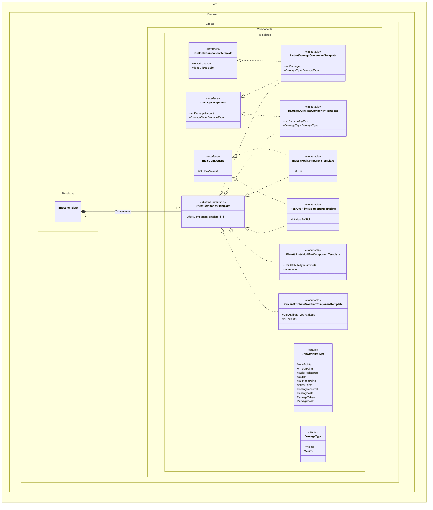

# EffectComponentTemplate

```mermaid
%%{init: {'themeVariables': { 'fontSize': '10px' }}}%%

classDiagram
  direction LR

%% ============================================================
%% EFFECT COMPONENT TEMPLATES
%% ============================================================

namespace Core.Domain.Effects.Components.Templates{
  class EffectComponentTemplate {
    <<abstract immutable>>
    +EffectComponentTemplateId Id
  }

  %% ----------------------------
  %% Capability interfaces
  %% ----------------------------
  class IDamageComponent {
    <<interface>>
    +int DamageAmount
    +DamageType DamageType
  }

  class IHealComponent {
    <<interface>>
    +int HealAmount
  }

  class ICrittableComponentTemplate {
    <<interface>>
    +int CritChance
    +float CritMultiplier
  }

  %% ----------------------------
  %% Concrete templates
  %% ----------------------------

  class InstantDamageComponentTemplate {
    <<immutable>>
    +int Damage
    +DamageType DamageType
  }

  class DamageOverTimeComponentTemplate {
    <<immutable>>
    +int DamagePerTick
    +DamageType DamageType
  }

  class InstantHealComponentTemplate {
    <<immutable>>
    +int Heal
  }

  class HealOverTimeComponentTemplate {
    <<immutable>>
    +int HealPerTick
  }

  class FlatAttributeModifierComponentTemplate {
    <<immutable>>
    +UnitAttributeType Attribute
    +int Amount
  }

  class PercentAttributeModifierComponentTemplate {
    <<immutable>>
    +UnitAttributeType Attribute
    +int Percent
  }

  class UnitAttributeType {
    <<enum>>
    MovePoints
    ArmourPoints
    MagicResistance
    MaxHP
    MaxManaPoints
    ActionPoints
    HealingReceived
    HealingDealt
    DamageTaken
    DamageDealt
  }

  class DamageType {
    <<enum>>
    Physical
    Magical
  }
}

%% Inheritance (templates)
EffectComponentTemplate <|.. InstantDamageComponentTemplate
EffectComponentTemplate <|.. DamageOverTimeComponentTemplate
EffectComponentTemplate <|.. InstantHealComponentTemplate
EffectComponentTemplate <|.. HealOverTimeComponentTemplate
EffectComponentTemplate <|.. FlatAttributeModifierComponentTemplate
EffectComponentTemplate <|.. PercentAttributeModifierComponentTemplate

%% Capability implementations
IDamageComponent <|.. InstantDamageComponentTemplate
IDamageComponent <|.. DamageOverTimeComponentTemplate

IHealComponent <|.. InstantHealComponentTemplate
IHealComponent <|.. HealOverTimeComponentTemplate

%% Optional crit capability (only if you want instant damage to crit)
ICrittableComponentTemplate <|.. InstantDamageComponentTemplate

%% -----------------------------------
%% EffectTemplate owns component templates
%% -----------------------------------
namespace Core.Domain.Effects.Templates{
  class EffectTemplate
}

EffectTemplate "1" *-- "1..*" EffectComponentTemplate : Components
```
