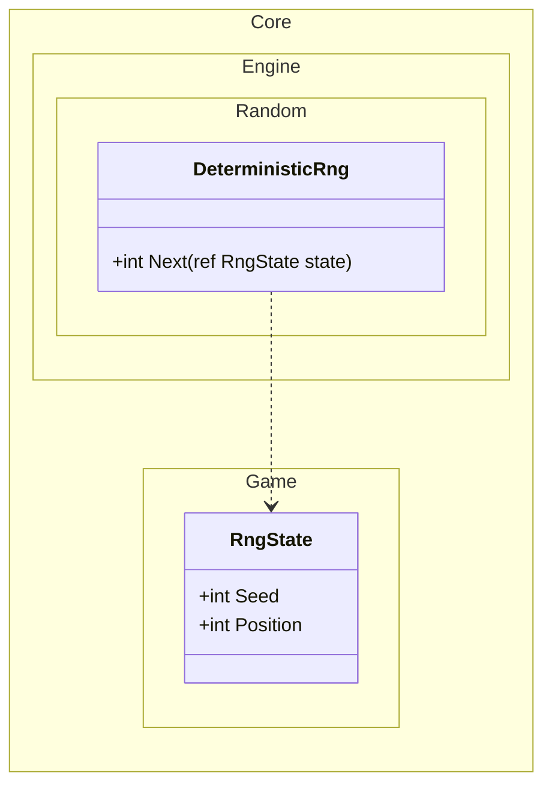

# DeterministicRng

```mermaid
classDiagram
direction LR

  namespace Core.Engine.Random {
  class DeterministicRng {
    +int Next(ref RngState state)
  }
  }
  namespace Core.Game {
  class RngState {
    +int Seed
    +int Position
  }
  }

  
  DeterministicRng ..> RngState
```
