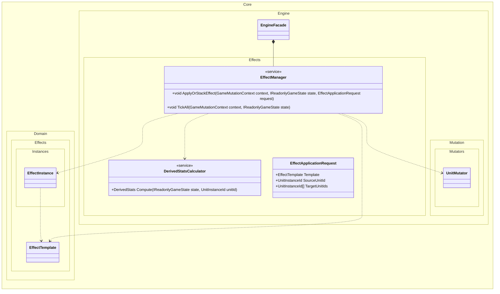

# EffectManager

```mermaid
classDiagram
    direction LR

    %% ==========================================
    %% Core Effects
    %% ==========================================
    namespace Core.Domain.Effects.Instances{
      class EffectInstance
    }

    namespace Core.Domain.Effects{
      class EffectTemplate
    }

    EffectInstance ..> EffectTemplate

    %% ==========================================
    %% Derived Stats (Query-Time Compute, Written via Mutator)
    %% ==========================================
    namespace Core.Engine.Effects{
      class DerivedStatsCalculator {
          <<service>>
          +DerivedStats Compute(IReadonlyGameState state, UnitInstanceId unitId)
      }
    }

    %% ==========================================
    %% Mutation Layer (write-only)
    %% ==========================================
    namespace Core.Engine.Mutation.Mutators{
      class UnitMutator
    }

    %% ==========================================
    %% MANAGER & INTEGRATION WITH RULES
    %% ==========================================
    namespace Core.Engine.Effects{
      class EffectApplicationRequest {
          +EffectTemplate Template
          +UnitInstanceId SourceUnitId
          +UnitInstanceId[] TargetUnitIds
      }

      class EffectManager {
          <<service>>
          +void ApplyOrStackEffect(GameMutationContext context, IReadonlyGameState state, EffectApplicationRequest request)
          +void TickAll(GameMutationContext context, IReadonlyGameState state)

          %% internal responsibility:
          %% after any effect-set change, compute + write derived stats for affected units
      }
    }

    namespace Core.Engine{
      class EngineFacade
    }

    %% ==========================================
    %% Wiring
    %% ==========================================

    EngineFacade *-- EffectManager

    EffectManager ..> EffectInstance
    EffectManager ..> EffectTemplate

    %% EffectManager orchestrates recompute (does not compute itself)
    EffectManager ..> DerivedStatsCalculator

    %% EffectManager writes new computed stats via mutation layer
    EffectManager ..> UnitMutator

```
