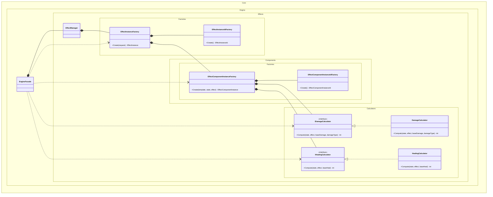

# Factories

```mermaid
%%{init: {'themeVariables': { 'fontSize': '9px' }}}%%
classDiagram
  direction LR

%% ============================================================
%% COMPOSITION ROOT
%% ============================================================
namespace Core.Engine {
  class EngineFacade
}

%% ============================================================
%% EFFECTS ORCHESTRATION
%% ============================================================
namespace Core.Engine.Effects {
  class EffectManager
}

EngineFacade *-- EffectManager

%% ============================================================
%% CALCULATORS
%% ============================================================
namespace Core.Engine.Effects.Calculators {

  class IDamageCalculator {
    <<interface>>
    +Compute(state, effect, baseDamage, damageType) int
  }

  class DamageCalculator {
    +Compute(state, effect, baseDamage, damageType) int
  }

  class IHealingCalculator {
    <<interface>>
    +Compute(state, effect, baseHeal) int
  }

  class HealingCalculator {
    +Compute(state, effect, baseHeal) int
  }
}

IDamageCalculator <|.. DamageCalculator
IHealingCalculator <|.. HealingCalculator


%% ============================================================
%% FACTORIES (EFFECT + COMPONENT)
%% ============================================================
namespace Core.Engine.Effects.Factories {

  class EffectInstanceFactory {
    +Create(request) EffectInstance
  }

  class EffectInstanceIdFactory {
    +Create() EffectInstanceId
  }
}

namespace Core.Engine.Effects.Components.Factories {

  class EffectComponentInstanceFactory {
    +Create(template, state, effect) EffectComponentInstance
  }

  class EffectComponentInstanceIdFactory {
    +Create() EffectComponentInstanceId
  }
}

%% ============================================================
%% OWNERSHIP / RETAINED DEPENDENCIES (FIELDS)
%% ============================================================

%% EffectManager retains the effect instance factory
EffectManager *-- EffectInstanceFactory

%% EffectInstanceFactory retains its sub-factories
EffectInstanceFactory *-- EffectInstanceIdFactory
EffectInstanceFactory *-- EffectComponentInstanceFactory

%% Component factory retains its id factory + calculators (snapshot-at-construction)
EffectComponentInstanceFactory *-- EffectComponentInstanceIdFactory
EffectComponentInstanceFactory *-- IDamageCalculator
EffectComponentInstanceFactory *-- IHealingCalculator

%% ============================================================
%% ENGINE FACADE WIRING (retains the concrete graph via interfaces)
%% ============================================================
EngineFacade ..> EffectInstanceFactory
EngineFacade ..> EffectComponentInstanceFactory
EngineFacade ..> IDamageCalculator
EngineFacade ..> IHealingCalculator
```
