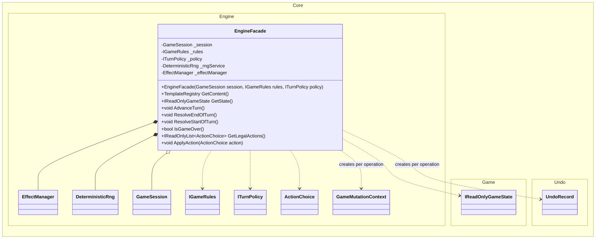

# EngineFacade

```mermaid
classDiagram
direction LR

  %% ============================================================
  %% ENGINE FACADE
  %%
  %% Top-level orchestrator and entry point into the simulation
  %% Owns long-lived services (rules, turn policy, RNG, effect manager)
  %% and holds the current GameSession (game state + content)
  %%
  %% Responsibilities:
  %% - Defines operation boundaries (action, tick, turn advance)
  %% - Creates a GameMutationContext per operation
  %% - Commits one UndoRecord per operation into UndoHistory
  %% - Routes mutations through rules, turn policy, and effect manager
  %% - Exposes read-only queries (state, legal actions, game over)
  %% - Exposes undo via UndoMarker / UndoTo(marker)
  %%
  %% All game state mutation flows through GameMutationContext
  %% ============================================================

  namespace Core.Engine{
    class EngineFacade {
      -GameSession _session
      -IGameRules _rules
      -ITurnPolicy _policy
      -DeterministicRng _rngService
      -EffectManager _effectManager

      +EngineFacade(GameSession session, IGameRules rules, ITurnPolicy policy)

      +TemplateRegistry GetContent()
      +IReadOnlyGameState GetState()

      +void AdvanceTurn()
      +void ResolveEndOfTurn()
      +void ResolveStartOfTurn()
      +bool IsGameOver()

      +IReadOnlyList~ActionChoice~ GetLegalActions()
      +void ApplyAction(ActionChoice action)
    }
  }

  %% ==========================================
  %% Core References
  %% ==========================================

  namespace Core.Game{
    class IReadOnlyGameState
  }

  namespace Core.Engine{
    class GameSession
    class ActionChoice
    class IGameRules
    class ITurnPolicy
    class DeterministicRng
    class EffectManager
    class GameMutationContext
  }

  namespace Core.Undo{
    class UndoRecord
  }

  %% ==========================================
  %% RELATIONSHIPS
  %% ==========================================

  %% EngineFacade owns the basic services it uses
  EngineFacade *-- EffectManager
  EngineFacade *-- DeterministicRng 

  %% GameSession is created externally (e.g., bootstrap / load)
  %% and EngineFacade holds the authoritative long-lived reference
  EngineFacade o-- GameSession

  %% EngineFacade depends on rules and turn policy behavior
  EngineFacade ..> IGameRules
  EngineFacade ..> ITurnPolicy

  %% EngineFacade exposes read-only state and legal actions
  EngineFacade ..> IReadOnlyGameState
  EngineFacade ..> ActionChoice

  %% EngineFacade creates a GameMutationContext per operation
  EngineFacade ..> GameMutationContext : creates per operation

  %% EngineFacade creates an UndoRecord per operation
  %% and passes it into the GameMutationContext
  EngineFacade ..> UndoRecord : creates per operation


```
