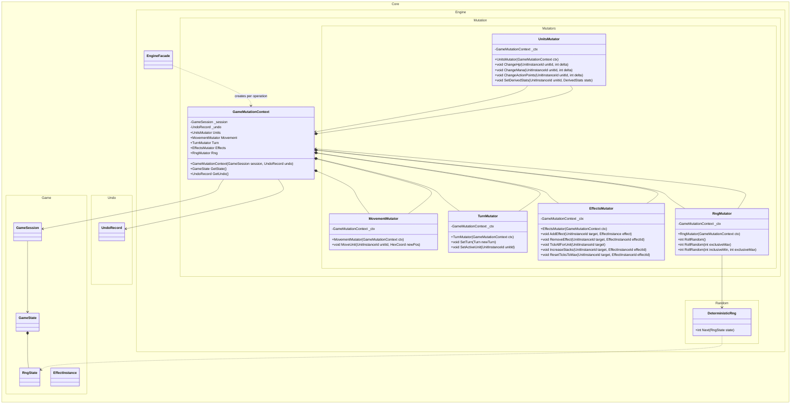

# GameMutationContext

```mermaid
classDiagram
direction LR

  %% ============================================================
  %% GAME MUTATION CONTEXT
  %%
  %% Per-operation mutation gateway
  %%
  %% Created by EngineFacade for each mutation operation
  %% Used by rules, turn policy, and effect manager to mutate state
  %%
  %% The only class allowed to mutate GameState
  %% Exposes grouped mutators (Units, Movement, Turn, Effects, Rng)
  %%
  %% Each mutator performs mutations and records undo steps
  %% into the operation’s UndoRecord
  %%
  %% Does not own services or match-scoped data
  %% ============================================================

  %% ------------------------------------------------------------
  %% Mutation Root
  %% ------------------------------------------------------------
  namespace Core.Engine.Mutation {
    class GameMutationContext {
      -GameSession _session
      -UndoRecord _undo

      +UnitsMutator Units
      +MovementMutator Movement
      +TurnMutator Turn
      +EffectsMutator Effects
      +RngMutator Rng

      +GameMutationContext(GameSession session, UndoRecord undo)

      +GameState GetState()
      +UndoRecord GetUndo()
    }
  }

  %% ------------------------------------------------------------
  %% Mutators
  %% ------------------------------------------------------------
  namespace Core.Engine.Mutation.Mutators {

    class UnitsMutator {
      -GameMutationContext _ctx
      +UnitsMutator(GameMutationContext ctx)
      +void ChangeHp(UnitInstanceId unitId, int delta)
      +void ChangeMana(UnitInstanceId unitId, int delta)
      +void ChangeActionPoints(UnitInstanceId unitId, int delta)
      +void SetDerivedStats(UnitInstanceId unitId, DerivedStats stats)
    }

    class MovementMutator {
      -GameMutationContext _ctx
      +MovementMutator(GameMutationContext ctx)
      +void MoveUnit(UnitInstanceId unitId, HexCoord newPos)
    }

    class TurnMutator {
      -GameMutationContext _ctx
      +TurnMutator(GameMutationContext ctx)
      +void SetTurn(Turn newTurn)
      +void SetActiveUnit(UnitInstanceId unitId)
    }

    class EffectsMutator {
      -GameMutationContext _ctx
      +EffectsMutator(GameMutationContext ctx)
      +void AddEffect(UnitInstanceId target, EffectInstance effect)
      +void RemoveEffect(UnitInstanceId target, EffectInstanceId effectId)
      +void TickAllForUnit(UnitInstanceId target)
      +void IncreaseStacks(UnitInstanceId target, EffectInstanceId effectId)
      +void ResetTicksToMax(UnitInstanceId target, EffectInstanceId effectId)
    }

    class RngMutator {
      -GameMutationContext _ctx
      +RngMutator(GameMutationContext ctx)
      +int RollRandom()
      +int RollRandom(int exclusiveMax)
      +int RollRandom(int inclusiveMin, int exclusiveMax)
    }
  }

  %% ------------------------------------------------------------
  %% Context <-> Mutator Composition & Access
  %% ------------------------------------------------------------

  %% Context exposes mutators
  GameMutationContext *-- UnitsMutator
  GameMutationContext *-- MovementMutator
  GameMutationContext *-- TurnMutator
  GameMutationContext *-- EffectsMutator
  GameMutationContext *-- RngMutator

  %% Mutators use context to access state + undo
  UnitsMutator --> GameMutationContext
  MovementMutator --> GameMutationContext
  TurnMutator --> GameMutationContext
  EffectsMutator --> GameMutationContext
  RngMutator --> GameMutationContext


  %% ==========================================
  %% Core References
  %% ==========================================

  %% ------------------------------------------------------------
  %% Game / State References
  %% ------------------------------------------------------------
  namespace Core.Game {
    class GameSession
    class GameState
    class RngState
    class EffectInstance
  }

  %% ------------------------------------------------------------
  %% Undo References
  %% ------------------------------------------------------------
  namespace Core.Undo {
    class UndoRecord
  }

  %% ------------------------------------------------------------
  %% Engine Orchestration
  %% ------------------------------------------------------------
  namespace Core.Engine {
    class EngineFacade
  }

  %% ------------------------------------------------------------
  %% RNG Service
  %% ------------------------------------------------------------
  namespace Core.Engine.Random {
    class DeterministicRng {
      +int Next(RngState state)
    }
  }

  %% ------------------------------------------------------------
  %% Operation Lifetime & State Access
  %% ------------------------------------------------------------

  %% EngineFacade creates GameMutationContext at the start of an operation
  EngineFacade ..> GameMutationContext : creates per operation

  %% Context lifetime & state access
  GameMutationContext --> GameSession
  GameSession --> GameState
  GameState *-- RngState

  %% Context uses an undo record, given to it by EngineFacade for this operation
  GameMutationContext --> UndoRecord

  %% ------------------------------------------------------------
  %% RNG Wiring
  %% ------------------------------------------------------------

  %% RNG service: stateless, used by RngMutator
  RngMutator --> DeterministicRng
  DeterministicRng ..> RngState

```
