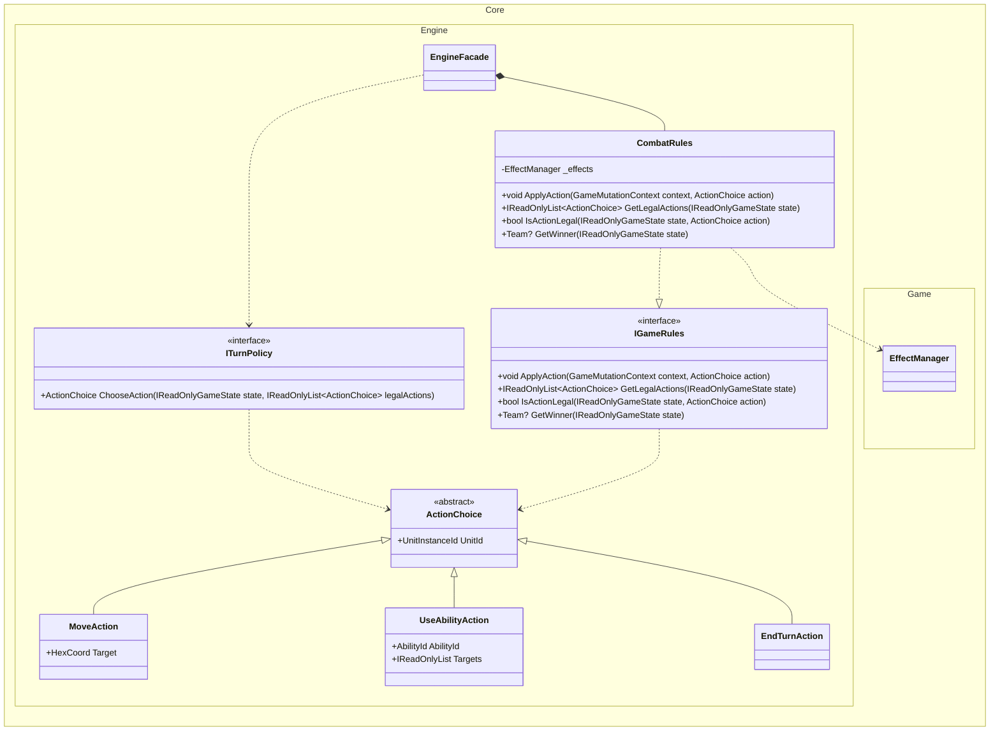

# IGameRules+IturnPolicy

```mermaid
classDiagram
    direction LR

    %% ==========================================
    %% REFERENCED CORE TYPES
    %% ==========================================

    namespace Core.Engine{
        class EngineFacade
    }

    namespace Core.Game{
        class EffectManager
    }
    %% ==========================================
    %% ACTIONS
    %% ==========================================

    namespace Core.Engine{
    class ActionChoice {
        <<abstract>>
        +UnitInstanceId UnitId
    }

    class MoveAction {
        +HexCoord Target
    }

    class UseAbilityAction {
        +AbilityId AbilityId
        +IReadOnlyList<UnitInstanceId> Targets    
    }

    class EndTurnAction {
    }
    }

    ActionChoice <|-- MoveAction
    ActionChoice <|-- UseAbilityAction
    ActionChoice <|-- EndTurnAction

    %% ==========================================
    %% RULES & TURN POLICY
    %% ==========================================

    namespace Core.Engine{
    class IGameRules {
        <<interface>>
        +void ApplyAction(GameMutationContext context, ActionChoice action)
        +IReadOnlyList~ActionChoice~ GetLegalActions(IReadOnlyGameState state)
        +bool IsActionLegal(IReadOnlyGameState state, ActionChoice action)
        +Team? GetWinner(IReadOnlyGameState state)
    }

    class CombatRules {
        +void ApplyAction(GameMutationContext context, ActionChoice action)
        +IReadOnlyList~ActionChoice~ GetLegalActions(IReadOnlyGameState state)
        +bool IsActionLegal(IReadOnlyGameState state, ActionChoice action)
        +Team? GetWinner(IReadOnlyGameState state)
        -EffectManager _effects
    }

    class ITurnPolicy {
        <<interface>>
        +ActionChoice ChooseAction(IReadOnlyGameState state, IReadOnlyList~ActionChoice~ legalActions)
    }
    }

    CombatRules ..|> IGameRules    
    CombatRules ..> EffectManager

    ITurnPolicy ..> ActionChoice

    IGameRules ..> ActionChoice

    EngineFacade *-- CombatRules
    EngineFacade ..> ITurnPolicy


```
