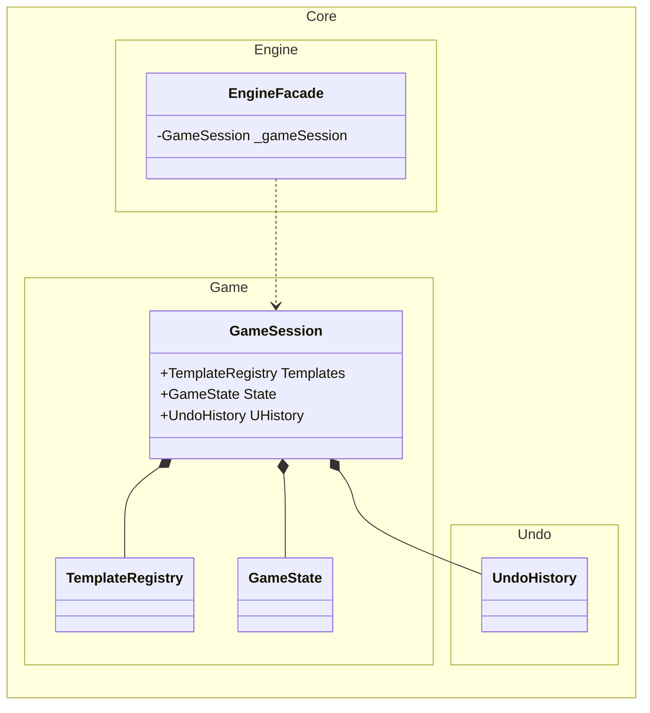

# GameSession

```mermaid
classDiagram
direction LR

  %% ============================================================
  %% GAME SESSION
  %%
  %% Match-scoped data container
  %%
  %% Owned by EngineFacade
  %% Created at game setup
  %%
  %% Used by EngineFacade for orchestration and state access
  %% Used by GameMutationContext to mutate GameState during operations
  %%
  %% Owns static content (TemplateRegistry),
  %% current mutable state (GameState),
  %% and undo history (UndoHistory)
  %%
  %% Does not own orchestration logic or services
  %% ============================================================

  namespace Core.Game{
  class GameSession {
    +TemplateRegistry Templates
    +GameState State
    +UndoHistory UHistory
  }
  }

  %% ==========================================
  %% Core References
  %% ==========================================

  namespace Core.Engine{
    class EngineFacade{
      -GameSession _gameSession
    }
  }
  namespace Core.Game{
    class TemplateRegistry
    class GameState
  }

  namespace Core.Undo{
    class UndoHistory
  }

  %% ==========================================
  %% RELATIONSHIPS
  %% ==========================================

  EngineFacade ..> GameSession

  GameSession *-- TemplateRegistry
  GameSession *-- GameState
  GameSession *-- UndoHistory


```
