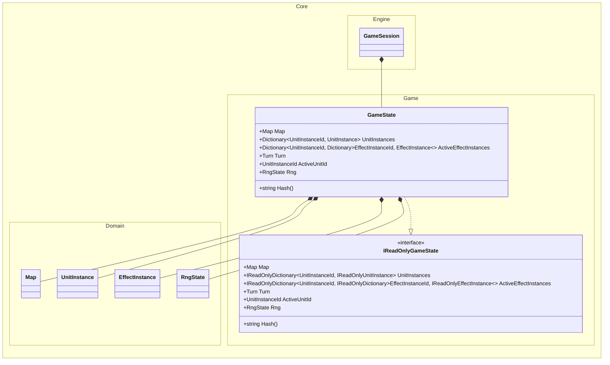

# GameState

```mermaid
classDiagram
direction LR

%% ============================================================
%% CORE STATE (MAP, TURN, GAMESTATE, RNG) + SESSION OWNER
%% GameState stays pure mutable match state.
%% GameSession owns GameState + TemplateRegistry (static content).
%% ============================================================

%% ------------------------------
%% Core refrences
%% ------------------------------

namespace Core.Domain {
class Map
class UnitInstance
class EffectInstance
class RngState
}

%% ------------------------------
%% Read-only view
%% ------------------------------
namespace Core.Game{
class IReadOnlyGameState {
  <<interface>>
  +Map Map
  +IReadOnlyDictionary~UnitInstanceId, IReadOnlyUnitInstance~ UnitInstances
  +IReadOnlyDictionary~UnitInstanceId, IReadOnlyDictionary~EffectInstanceId, IReadOnlyEffectInstance~~ ActiveEffectInstances
  +Turn Turn
  +UnitInstanceId ActiveUnitId
  +RngState Rng
  +string Hash()
}

%% ------------------------------
%% Mutable state
%% ------------------------------

class GameState {
  +Map Map
  +Dictionary~UnitInstanceId, UnitInstance~ UnitInstances
  +Dictionary~UnitInstanceId, Dictionary~EffectInstanceId, EffectInstance~~ ActiveEffectInstances
  +Turn Turn
  +UnitInstanceId ActiveUnitId
  +RngState Rng
  +string Hash()
}
}

GameState ..|> IReadOnlyGameState

GameState *-- Map
GameState *-- UnitInstance
GameState *-- EffectInstance
GameState *-- RngState

%% ------------------------------
%% Gamestate owner
%% ------------------------------
namespace Core.Engine{
class GameSession 
}

GameSession *-- GameState

```
