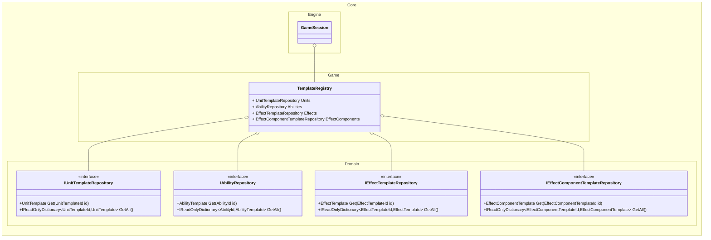

# TemplateRegistry

```mermaid
classDiagram
direction LR

%% ------------------------------
%% Repo interfaces (Core contracts)
%% ------------------------------

namespace Core.Domain{
  class IUnitTemplateRepository {
    <<interface>>
    +UnitTemplate Get(UnitTemplateId id)
    +IReadOnlyDictionary~UnitTemplateId,UnitTemplate~ GetAll()
  }

  class IAbilityRepository {
    <<interface>>
    +AbilityTemplate Get(AbilityId id)
    +IReadOnlyDictionary~AbilityId,AbilityTemplate~ GetAll()
  }

  class IEffectTemplateRepository {
    <<interface>>
    +EffectTemplate Get(EffectTemplateId id)
    +IReadOnlyDictionary~EffectTemplateId,EffectTemplate~ GetAll()
  }

  class IEffectComponentTemplateRepository {
    <<interface>>
    +EffectComponentTemplate Get(EffectComponentTemplateId id)
    +IReadOnlyDictionary~EffectComponentTemplateId,EffectComponentTemplate~ GetAll()
  }

}
namespace Core.Game{
  %% ------------------------------
  %% Registry/container for repos
  %% ------------------------------
  class TemplateRegistry {
    +IUnitTemplateRepository Units
    +IAbilityRepository Abilities
    +IEffectTemplateRepository Effects
    +IEffectComponentTemplateRepository EffectComponents
  }
}

%% ------------------------------
%% Engine entry point consumes registry
%% ------------------------------
namespace Core.Engine{
class GameSession
}


TemplateRegistry o-- IUnitTemplateRepository
TemplateRegistry o-- IAbilityRepository
TemplateRegistry o-- IEffectTemplateRepository
TemplateRegistry o-- IEffectComponentTemplateRepository

GameSession o-- TemplateRegistry

```
