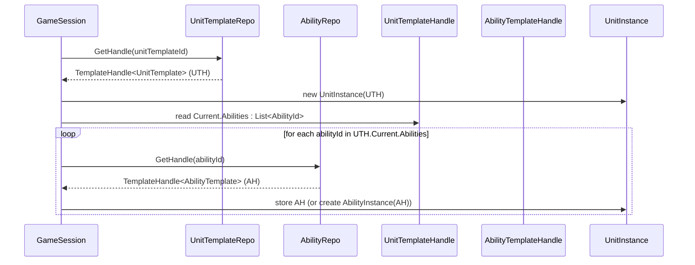

# test

```mermaid
sequenceDiagram
  participant GS as GameSession
  participant UR as UnitTemplateRepo
  participant AR as AbilityRepo
  participant UTH as UnitTemplateHandle
  participant AH as AbilityTemplateHandle
  participant UI as UnitInstance

  GS->>UR: GetHandle(unitTemplateId)
  UR-->>GS: TemplateHandle<UnitTemplate> (UTH)
  GS->>UI: new UnitInstance(UTH)
  GS->>UTH: read Current.Abilities : List<AbilityId>

  loop for each abilityId in UTH.Current.Abilities
    GS->>AR: GetHandle(abilityId)
    AR-->>GS: TemplateHandle<AbilityTemplate> (AH)
    GS->>UI: store AH (or create AbilityInstance(AH))
  end

```
