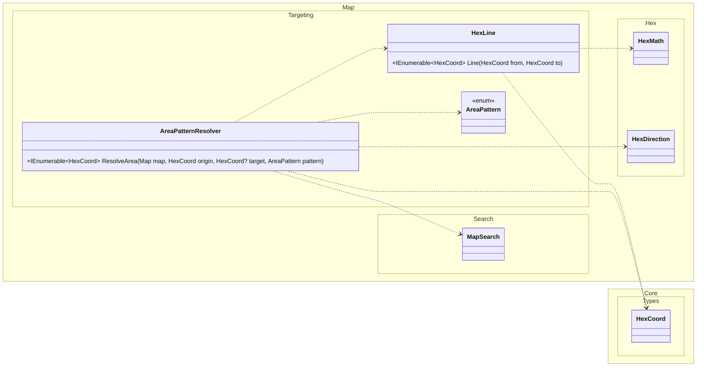

# AreaPatternResolver

```mermaid
classDiagram
direction LR

    namespace Map.Targeting {
    class HexLine {
        +IEnumerable~HexCoord~ Line(HexCoord from, HexCoord to)
    }

    class AreaPattern {
        <<enum>>
    }

    class AreaPatternResolver {
        +IEnumerable~HexCoord~ ResolveArea(Map map, HexCoord origin, HexCoord? target, AreaPattern pattern)
    }
    }

    %% ---- stubs (shared types) ----

    namespace Map.Hex { 
        class HexMath 
        class HexDirection 
    }
    namespace Map.Search { 
        class MapSearch 
    }


    namespace Core.Types {
    class HexCoord
    }
    %% ---- relationships ----
    HexLine ..> HexCoord
    HexLine ..> HexMath

    AreaPatternResolver ..> HexCoord
    AreaPatternResolver ..> HexDirection
    AreaPatternResolver ..> MapSearch
    AreaPatternResolver ..> HexLine
    AreaPatternResolver ..> AreaPattern

```
