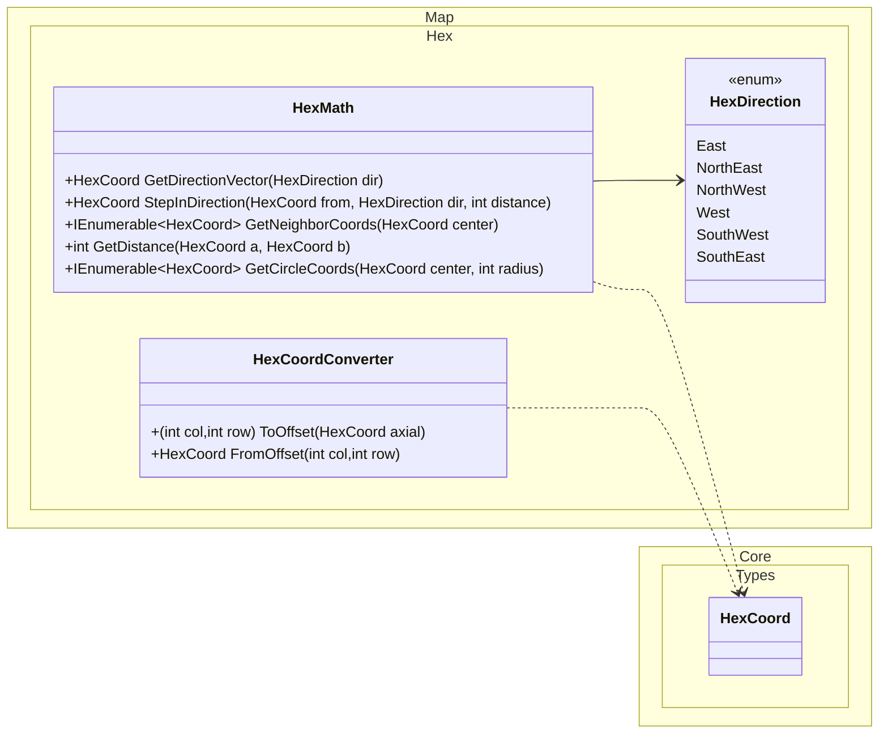

# HexMath

```mermaid
classDiagram
direction LR

%% ============================================================
%% HEX MATH (FLAT-TOP)
%%
%% Stateless helpers for working with a flat-top hex grid in axial
%% coordinates. Defines direction semantics/deltas, stepping and neighbor
%% enumeration, axial distance, simple area queries (e.g., radius), and
%% axial<->offset conversion hooks for array-backed storage.
%% ============================================================

namespace Map.Hex {

  class HexDirection {
    <<enum>>
    East
    NorthEast
    NorthWest
    West
    SouthWest
    SouthEast
  }
}

namespace Map.Hex {
  class HexMath {
    +HexCoord GetDirectionVector(HexDirection dir)
    +HexCoord StepInDirection(HexCoord from, HexDirection dir, int distance)
    +IEnumerable~HexCoord~ GetNeighborCoords(HexCoord center)
    +int GetDistance(HexCoord a, HexCoord b)
    +IEnumerable~HexCoord~ GetCircleCoords(HexCoord center, int radius)
  }
}

namespace Map.Hex {
  class HexCoordConverter {
    +(int col,int row) ToOffset(HexCoord axial)
    +HexCoord FromOffset(int col,int row)
  }
}

namespace Core.Types {
  class HexCoord
}

HexMath ..> HexCoord
HexMath --> HexDirection
HexCoordConverter ..> HexCoord

```
