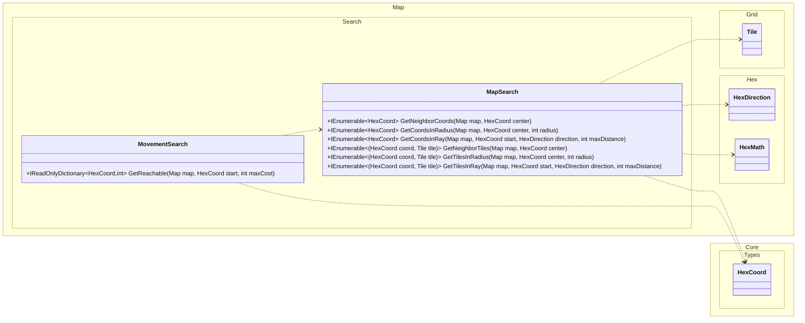

# MapSearch

```mermaid
classDiagram
direction LR

%% ============================================================
%% MAP SEARCH (SPATIAL QUERIES)
%%
%% Query helpers over Map using hex-space coordinates: neighbors, radius
%% areas, and directional rays. Offers coordinate-only and coord+tile
%% variants. Includes a reachability search to compute which coords are
%% reachable within a movement budget (used by movement validation / UI).
%% ============================================================

namespace Map.Search {
  class MapSearch {
    +IEnumerable~HexCoord~ GetNeighborCoords(Map map, HexCoord center)
    +IEnumerable~HexCoord~ GetCoordsInRadius(Map map, HexCoord center, int radius)
    +IEnumerable~HexCoord~ GetCoordsInRay(Map map, HexCoord start, HexDirection direction, int maxDistance)

    +IEnumerable~(HexCoord coord, Tile tile)~ GetNeighborTiles(Map map, HexCoord center)
    +IEnumerable~(HexCoord coord, Tile tile)~ GetTilesInRadius(Map map, HexCoord center, int radius)
    +IEnumerable~(HexCoord coord, Tile tile)~ GetTilesInRay(Map map, HexCoord start, HexDirection direction, int maxDistance)
  }

class MovementSearch {
  +IReadOnlyDictionary~HexCoord,int~ GetReachable(Map map, HexCoord start, int maxCost)
}
}


namespace Map.Grid {
  class Tile 
}
namespace Map.Hex { 
  class HexDirection 
  class HexMath 
}
namespace Core.Types {
  class HexCoord
}

MapSearch ..> Tile
MapSearch ..> HexCoord
MapSearch ..> HexDirection
MapSearch ..> HexMath

MovementSearch ..> MapSearch
MovementSearch ..> HexCoord
```
