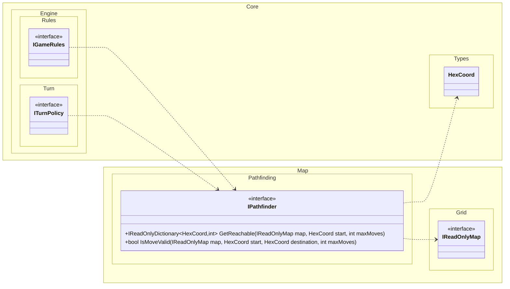

# Pathfinding

```mermaid
classDiagram
direction LR

namespace Map.Pathfinding {

  class IPathfinder {
    <<interface>>
    +IReadOnlyDictionary~HexCoord,int~ GetReachable(IReadOnlyMap map, HexCoord start, int maxMoves)
    +bool IsMoveValid(IReadOnlyMap map, HexCoord start, HexCoord destination, int maxMoves)
  }

}

namespace Map.Grid {
  class IReadOnlyMap {
    <<interface>>
  }
}

namespace Core.Engine.Rules {
  class IGameRules {
    <<interface>>
  }
}

namespace Core.Engine.Turn {
  class ITurnPolicy {
    <<interface>>
  }
}

namespace Core.Types {
  class HexCoord
}

%% ------------------------------------------------------------
%% Dependencies
%% ------------------------------------------------------------

%% Pathfinder reads from map + coords
IPathfinder ..> IReadOnlyMap
IPathfinder ..> HexCoord

%% Rules and turn policy use pathfinding
IGameRules ..> IPathfinder
ITurnPolicy ..> IPathfinder
```
