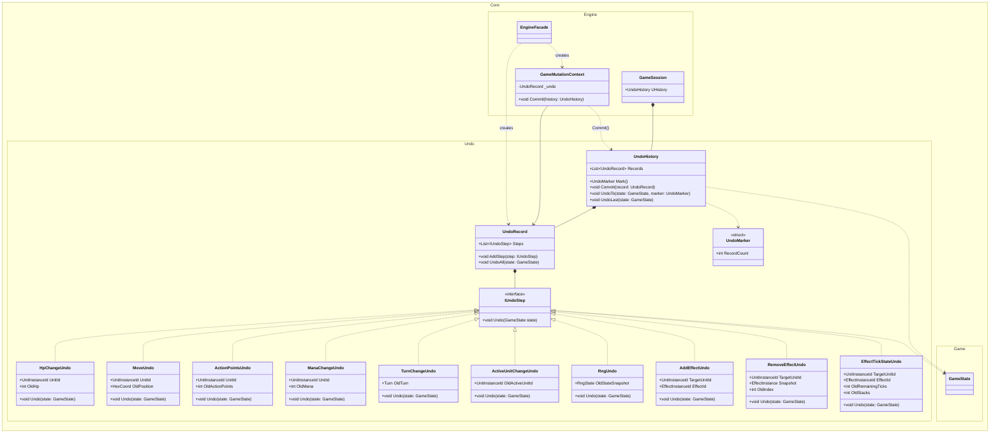

# UndoHistory

```mermaid
classDiagram
  direction LR

  %% ==========================================
  %% UNDO HISTORY
  %%
  %% Match-scoped undo store.
  %% Owned by GameSession.
  %% Used by EngineFacade to commit operations and perform undo
  %%
  %% Stores a flat list of UndoRecords
  %% Supports UndoMarker creation and undo-to-marker
  %%
  %% Each operation commits exactly one UndoRecord
  %% UndoRecord is made up of Undo steps
  %% Undo steps are created by GameMutationContext during mutations
  %% that are performed duing an operation
  %%
  %% All undo is performed by replaying records in reverse
  %% ==========================================

  namespace Core.Undo{
    class IUndoStep {
      <<interface>>
      +void Undo(GameState state)
    }

    class UndoRecord {
      +List~IUndoStep~ Steps
      +void AddStep(step: IUndoStep)
      +void UndoAll(state: GameState)
    }

    class UndoMarker {
      <<struct>>
      +int RecordCount
    }

    class UndoHistory {
      +List~UndoRecord~ Records
      +UndoMarker Mark()
      +void Commit(record: UndoRecord)
      +void UndoTo(state: GameState, marker: UndoMarker)
      +void UndoLast(state: GameState)
    }
  }

  %% ==========================================
  %% Core References
  %% ==========================================

  namespace Core.Engine{
    class GameMutationContext {
      -UndoRecord _undo
      +void Commit(history: UndoHistory)
    }

    class EngineFacade

    class GameSession{
      +UndoHistory UHistory
    }
  }

  %% ==========================================
  %% CONCRETE UNDO STEPS (EXAMPLES)
  %% NOTE: Store IDs + value snapshots, never live object references
  %% ==========================================

  namespace Core.Game{
    class GameState
  }

  namespace Core.Undo{
    class HpChangeUndo {
      +UnitInstanceId UnitId
      +int OldHp
      +void Undo(state: GameState)
    }

    class MoveUndo {
      +UnitInstanceId UnitId
      +HexCoord OldPosition
      +void Undo(state: GameState)
    }

    class ActionPointsUndo {
      +UnitInstanceId UnitId
      +int OldActionPoints
      +void Undo(state: GameState)
    }

    class ManaChangeUndo {
      +UnitInstanceId UnitId
      +int OldMana
      +void Undo(state: GameState)
    }

    class TurnChangeUndo {
      +Turn OldTurn
      +void Undo(state: GameState)
    }

    class ActiveUnitChangeUndo {
      +UnitInstanceId OldActiveUnitId
      +void Undo(state: GameState)
    }

    class RngUndo {
      +RngState OldStateSnapshot
      +void Undo(state: GameState)
    }

    %% Effect lifecycle

    class AddEffectUndo {
      +UnitInstanceId TargetUnitId
      +EffectInstanceId EffectId
      +void Undo(state: GameState)
    }

    %% Used when an effect is removed (including expiry)
    %% Snapshot must be a deep snapshot (not the same live reference)
    class RemoveEffectUndo {
      +UnitInstanceId TargetUnitId
      +EffectInstance Snapshot
      +int OldIndex
      +void Undo(state: GameState)
    }

    %% Used when ticking an effect (remaining ticks / stacks changed)
    class EffectTickStateUndo {
      +UnitInstanceId TargetUnitId
      +EffectInstanceId EffectId
      +int OldRemainingTicks
      +int OldStacks
      +void Undo(state: GameState)
    }
  }

  %% ==========================================
  %% RELATIONSHIPS
  %% ==========================================

  %% Engine Facade creates and passes the operation-local undo record to Game Mutation Context
  EngineFacade ..> UndoRecord : creates
  EngineFacade ..> GameMutationContext : creates
  GameMutationContext --> UndoRecord
  GameMutationContext ..> UndoHistory : Commit()

  %% History contains records; records contain steps
  UndoHistory *-- UndoRecord
  UndoRecord *-- IUndoStep
  UndoHistory ..> UndoMarker

  %% GameSession Owns UndoHistory
  GameSession *-- UndoHistory

  %% Undo steps implement interface
  IUndoStep <|.. HpChangeUndo
  IUndoStep <|.. MoveUndo
  IUndoStep <|.. ActionPointsUndo
  IUndoStep <|.. ManaChangeUndo
  IUndoStep <|.. TurnChangeUndo
  IUndoStep <|.. ActiveUnitChangeUndo
  IUndoStep <|.. RngUndo
  IUndoStep <|.. AddEffectUndo
  IUndoStep <|.. RemoveEffectUndo
  IUndoStep <|.. EffectTickStateUndo

  %% Undo operations target GameState
  IUndoStep ..> GameState
  UndoHistory ..> GameState

```
