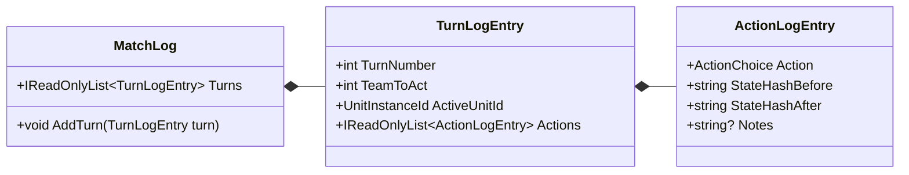

# match_log

```mermaid
    classDiagram
    direction LR
    %% ==========================================
    %% PER-TURN LOGGING
    %% ==========================================

    class MatchLog {
        +IReadOnlyList~TurnLogEntry~ Turns
        +void AddTurn(TurnLogEntry turn)
    }

    class TurnLogEntry {
        +int TurnNumber
        +int TeamToAct
        +UnitInstanceId ActiveUnitId
        +IReadOnlyList~ActionLogEntry~ Actions
    }

    class ActionLogEntry {
        +ActionChoice Action
        +string StateHashBefore
        +string StateHashAfter
        +string? Notes
    }

    MatchLog *-- TurnLogEntry
    TurnLogEntry *-- ActionLogEntry

    
```
